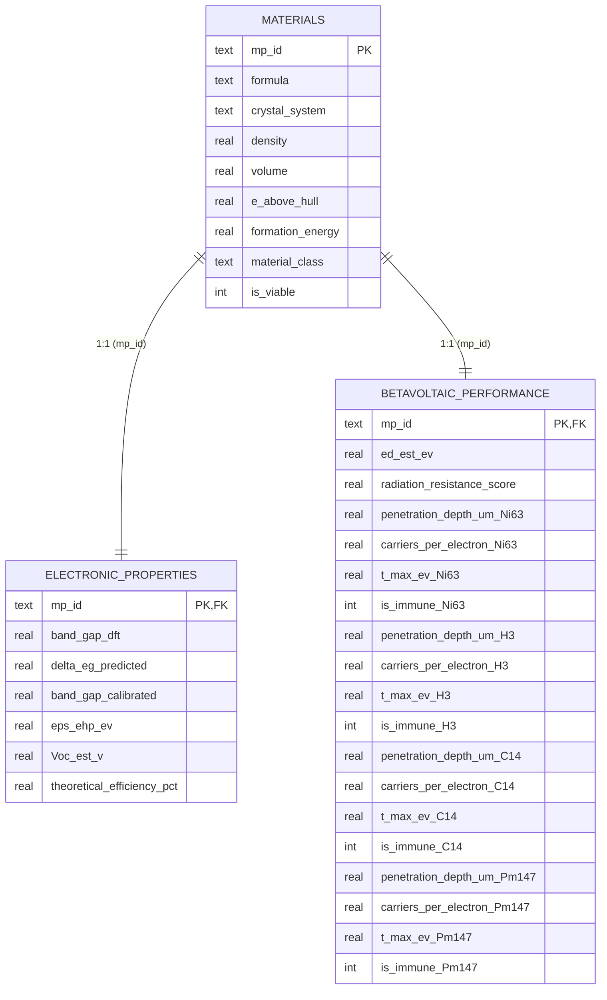

# Информационно-аналитическая система скрининга бетавольтаических материалов

> **Магистерская диссертация:** «Разработка библиотеки бетавольтаических материалов»  
> **Организация:** Самарский государственный технический университет (СамГТУ)  
> **Специальность:** Информатика и вычислительная техника / Интеллектуальный анализ данных (Data Science)

Информационно-аналитический комплекс для квантово-машинного скрининга, канонического $\Delta$-обучения (Delta-Learning) и многокритериальной 3D Парето-оптимизации полупроводниковых материалов для автономных источников питания (ядерных микробатарей) на бета-изотопах $^{63}\text{Ni}$, $^{3}\text{H}$, $^{14}\text{C}$ и $^{147}\text{Pm}$.

---

## 🔬 1. Теоретико-физические основы

Система производит физическое моделирование прямого преобразования энергии бета-излучения в электрическую энергию по следующим каноническим моделям:

### 1.1. Генерация электронно-дырочных пар (Правило Кляйна, 1968)
Средняя энергия образования неравновесной электронно-дырочной пары:
$$\varepsilon_{ehp} = 2.8 \cdot E_g + 0.5 \quad (\text{эВ})$$
Число генерируемых пар на одну поглощенную бета-частицу со средней энергией $\bar{E}_\beta$:
$$N_{pairs} = \frac{\bar{E}_\beta}{\varepsilon_{ehp}}$$

### 1.2. Пробег бета-электронов в полупроводнике (Формула Фельдмана, 1960)
Толщина слоя полного поглощения энергии бета-электронов:
$$R = \frac{0.04 \cdot E_\beta^{1.75}}{\rho} \quad (\text{мкм})$$
где $\rho$ — кристаллографическая плотность вещества (г/см³), $E_\beta$ — энергия электрона (кэВ).

### 1.3. Ионизационные потери энергии (Модель Бете-Блоха в модификации Джоя-Ло, 1989)
Удельная тормозная способность для электронов средних энергий (1–100 кэВ):
$$-\frac{dE}{dx} = 78.5 \cdot \frac{\rho \cdot Z_{eff}}{A_{eff} \cdot E} \cdot \ln\left[1.166 \cdot \frac{E + 0.73 J}{J}\right] \quad \left(\frac{\text{кэВ}}{\text{мкм}}\right)$$
где $J = 11.5 \cdot 10^{-3} Z_{eff}$ (кэВ) — средний ионизационный потенциал.

### 1.4. Релятивистский кинематический порог радиационного дефектообразования
Максимальная кинетическая энергия, передаваемая ядру кристаллической решетки с массой $M = A_{eff} \cdot m_u$ при лобовом упругом соударении с электроном максимальной энергии $E_{max}$:
$$T_{max} = \frac{2 E_{max} (E_{max} + 2 m_e c^2)}{M c^2} \quad (\text{эВ})$$
* **Условие радиационной неуязвимости:** Если $T_{max} < E_d$ (где $E_d$ — пороговая энергия смещения атома из узла решетки), бета-электроны изотопа **физически не способны** создавать дефекты смещения (пары Френкеля).

### 1.5. Предельный КПД бетавольтаического преобразования (Модель Шокли-Олсена)
$$\eta_{theor} = \frac{V_{oc}(E_g)}{\varepsilon_{ehp}(E_g)} \cdot FF \cdot 100\%$$
с учетом диодного насыщения и спада собирания носителей в глубоких изоляторах ($E_g > 5.5$ эВ).

---

## 🤖 2. Машинное обучение: Канонический Delta-Learning

Для устранения систематической квантово-механической недооценки ширины запрещенной зоны в расчетах DFT (функционал GGA-PBE) реализован подход **Delta-Learning** (*Ramakrishnan et al., JCTC 2015*):

$$\Delta E_g = E_g^{exp} - E_g^{DFT}$$
$$E_g^{calibrated} = E_g^{DFT} + \Delta E_g^{predicted}$$

* **Алгоритм:** `CatBoostRegressor` с $L_2$-регуляризацией (`l2_leaf_reg=4.0`, `depth=5`, `iterations=800`).
* **Пространство признаков (135 дескрипторов):**
  * 3 фундаментальных квантово-физических дескриптора ($E_g^{DFT}$, плотность $\rho$, объем ячейки $V$);
  * 132 физико-химических дескриптора набора **Magpie** (`matminer`), отражающих электроотрицательность, атомные радиусы, валентности и температуры плавления.
* **Результаты валидации:**
  * DFT Baseline MAE: **0.871 эВ** ($R^2 = 0.474$);
  * Delta-Learning CatBoost MAE: **0.553 эВ** ($R^2 = 0.711$);
  * **Снижение погрешности: на 36.5%**;
  * **Групповая валидация (`GroupKFold`):** Подтверждена устойчивость на изолированных химических семействах (оксиды, халькогениды, пниктиды, карбиды).
* **Объяснимость (XAI):** `shap.TreeExplainer` для физической верификации вклада атомных радиусов и электроотрицательности.

---

## 🗄️ 3. Архитектура реляционной базы данных (SQLite, 3NF)

База данных `data/05_database/betavoltaic_library.db` включает 22,266 кристаллических фаз, нормализованных в третью нормальную форму:



---

## 🚀 4. Установка и запуск

### 4.1. Установка окружения
```bash
# Клонирование репозитория
git clone https://github.com/username/betavolt-screening.git
cd betavolt-screening

# Создание и активация виртуального окружения
python -m venv .venv
source .venv/bin/activate  # Linux / macOS
.venv\Scripts\activate     # Windows

# Установка зависимостей
pip install -r requirements.txt
```

### 4.2. Запуск интерактивного дашборда Streamlit
```bash
streamlit run app/main.py
```

### 4.3. Запуск автоматических тестов (pytest)
```bash
pytest tests/
```

### 4.4. Диагностика и дебаг системы
```bash
python scripts/debug_test_screening.py
```

---

## 📁 5. Структура проекта

```text
betavolt-screening/
├── app/                        # Интерактивное веб-приложение Streamlit
│   ├── main.py                 # Главный модуль дашборда (4 вкладки)
│   └── plots.py                # Модуль отрисовки 2D/3D графиков Plotly
├── configs/                    # YAML-конфигурации
│   ├── data_config.yaml        # Параметры выгрузки из Materials Project
│   ├── isotopes.yaml           # Физические константы радиоизотопов
│   └── model_config.yaml       # Гиперпараметры CatBoost и дескрипторы
├── data/                       # Версионированные данные (Data Lake)
│   ├── 01_raw/                 # Сырая выгрузка из Materials Project (Parquet)
│   ├── 02_intermediate/        # Очищенные кристаллы без ядов/дубликатов
│   ├── 03_features/            # Матрицы дескрипторов Magpie и калиброванные Eg
│   ├── 04_external/            # Экспериментальный бенчмарк (matbench_expt_gap)
│   └── 05_database/            # Реляционная SQLite база данных библиотеки
├── models/                     # Обученные модели и отчеты
│   ├── delta_eg_catboost.cbm   # Сериализованные веса CatBoost
│   └── metrics_report.json     # Метрики кросс-валидации (MAE, R2)
├── notebooks/                  # Исследовательские Jupyter-ноутбуки
│   ├── 01_data_extraction.ipynb
│   ├── 02_eda_and_clustering.ipynb
│   ├── 03_ml_experiments.ipynb
│   └── 04_pareto_screening.ipynb
├── reports/figures/            # Графика, SHAP-диаграммы и Парето-чемпионы
├── src/                        # Исходный код Python
│   ├── data/                   # Сбор, парсинг и очистка данных (cleaner, fetcher, loader)
│   ├── database/               # DDL-схема и репозиторий SQLite (schema, repository)
│   ├── features/               # Генераторы дескрипторов (composition, structural)
│   ├── models/                 # Обучение, GroupKFold и SHAP (delta_learner, explainability, validation)
│   ├── physics/                # Физический движок (betavoltaics, stopping_power)
│   └── screening/              # Парето-оптимизация и ранжирование (pareto, ranker)
├── tests/                      # Автоматические тесты (pytest)
└── pyproject.toml              # Метаданные пакета и зависимости
```

---

## 📚 6. Список литературы и источников

1. **Ramakrishnan, R., Dral, P. O., Rupp, M., & von Lilienfeld, O. A.** (2015). *Big Data Meets Quantum Chemistry Approximations: The $\Delta$-Machine Learning Approach.* J. Chem. Theory Comput., 11(5), 2087–2096.
2. **Klein, C. A.** (1968). *Bandgap Dependence and Related Features of Radiation Ionization Energies in Semiconductors.* J. Appl. Phys., 39(4), 2029–2038.
3. **Joy, D. C., & Luo, S.** (1989). *An empirical stopping power relationship for low-energy electrons.* Scanning, 11(4), 176–180.
4. **Feldman, C.** (1960). *Range of 1–10 keV Electrons in Solids.* Phys. Rev., 117(2), 455.
5. **Olsen, L. C.** (1974). *Review of Betavoltaic Energy Conversion.* Intersociety Energy Conversion Engineering Conference, 739005.
6. **Bormashov, V. S., et al.** (2018). *High power density nuclear battery prototype based on diamond biochemical Schottky diodes.* Diamond and Related Materials, 84, 41–47.
