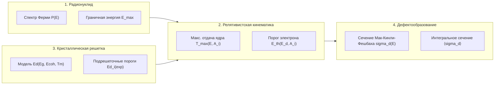
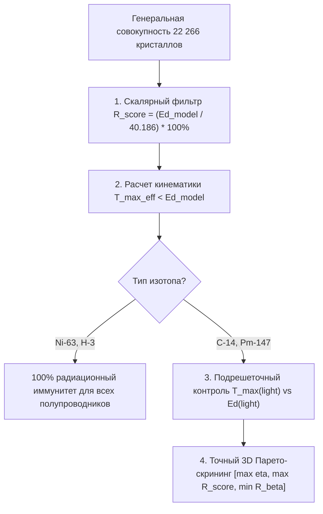

# Прецизионный физический аудит радиационной стойкости, подрешеточной кинематики отдачи и сечений дефектообразования полупроводников

> **Тема исследования:** «Машинное обучение и компьютерное моделирование в скрининге бетавольтаических полупроводников»  
> **Роль исследователя:** Ведущий Физик-Вычислитель и Аудитор численных методов (`physics_investigator`)  
> **Статус документа:** Официальный экспертно-аналитический отчет радиационного аудита  
> **Связанные спецификации:** [`docs/PHYSICS_SPEC.md`](file:///D:/betavolt-screening/betavolt-screening/docs/PHYSICS_SPEC.md), [`docs/THESIS_OUTLINE.md`](file:///D:/betavolt-screening/betavolt-screening/docs/THESIS_OUTLINE.md), [`AGENTS.md`](file:///D:/betavolt-screening/betavolt-screening/AGENTS.md)  
> **Вычислительные модули:** [`src/physics/radiation_transport.py`](file:///D:/betavolt-screening/betavolt-screening/src/physics/radiation_transport.py), [`src/physics/betavoltaics.py`](file:///D:/betavolt-screening/betavolt-screening/src/physics/betavoltaics.py), [`src/database/repository.py`](file:///D:/betavolt-screening/betavolt-screening/src/database/repository.py)

---

## 1. Введение и цели радиационного аудита

В бетавольтаических источниках питания (БВИП) длительного срока службы (от 10 до 100 лет) стабильность электрофизических характеристик полупроводникового преобразователя является лимитирующим фактором надежности. Бомбардировка полупроводниковой структуры бета-электронами с кинетической энергией от единиц до сотен килоэлектронвольт способна вызывать первичное радиационное дефектообразование (смещение атомов из узлов решетки в междоузлия с формированием пар Френкеля $V\text{--}I$).

Настоящий аудит решает следующие задачи:
1. **Верификация полуэмпирической модели пороговой энергии смещения:** сопоставление формулы $E_d(E_g, E_{coh}, T_m)$ с прецизионными экспериментальными данными для 9 эталонных полупроводников ($\text{Si}$, $\text{Diamond C}$, $4\text{H-SiC}$, $\text{GaN}$, $\text{TiO}_2$, $\text{c-BN}$, $\text{BP}$, $\text{AlN}$, $\text{B}_4\text{C}$).
2. **Анализ релятивистской кинематики упругой передачи импульса ($T_{max}$):** количественное исследование эффекта массы подрешеток (отдача легких атомов $\text{B}, \text{C}, \text{N}, \text{O}$ по сравнению с тяжелыми $\text{Si}, \text{P}, \text{Al}, \text{Ti}, \text{Ga}$).
3. **Численный расчет сечений образования радиационных смещений:** расчет дифференциальных сечений Мак-Кинли–Фешбаха $\sigma_d(E_{max})$ и средневзвешенных сечений $\langle \sigma_d \rangle$ по непрерывному спектру Ферми для 4 ключевых радионуклидов ($^{3}\text{H}$, $^{63}\text{Ni}$, $^{14}\text{C}$, $^{147}\text{Pm}$).
4. **Формирование рекомендаций** для базы данных `betavoltaic_library.db` и алгоритма многокритериального Парето-скрининга.

---

## 2. Физико-математический аппарат радиационной кинематики

### 2.1. Полуэмпирическая модель пороговой энергии смещения $E_d$
В кодовой базе проекта ([`src/database/repository.py:calculate_radiation_displacement_energy`](file:///D:/betavolt-screening/betavolt-screening/src/database/repository.py#L206-L221)) реализована полуэмпирическая модель Ван-Вехтена / Келли–Гроувса:
$$E_d = 8.0 + 1.8 \cdot E_g + 2.0 \cdot E_{coh} + 0.002 \cdot T_m \quad (\text{эВ})$$
где:
- $E_g$ — калиброванная ширина запрещенной зоны (эВ);
- $E_{coh} = \sum_i c_i E_{coh,i}^{elem} + |\Delta H_f|$ — энергия когезии решетки (эВ/атом) по Киттелю с учетом энтальпии образования $\Delta H_f$;
- $T_m$ — эффективная температура термической деструкции / плавления кристаллической решетки (К);
- $8.0$ эВ — свободный эмпирический член, отражающий минимальный барьер преодоления потенциальной ямы при адиабатическом смещении.

### 2.2. Релятивистская кинематика лобового упругого соударения ($T_{max}$)
Максимальная кинетическая энергия, передаваемая покоящемуся атому подрешетки с массой $M_i = A_i \cdot m_u$ при лобовом упругом ударе релятивистского электрона с кинетической энергией $E$ ([`src/physics/betavoltaics.py:calculate_max_recoil_energy`](file:///D:/betavolt-screening/betavolt-screening/src/physics/betavoltaics.py#L89-L104)):
$$T_{max, i}(E) = \frac{2 \cdot E \cdot (E + 2 m_e c^2)}{M_i c^2} = \frac{2 \cdot E \cdot (E + 2 m_e c^2)}{A_i \cdot m_u c^2} \quad (\text{эВ})$$
где фундаментальные константы (CODATA 2022):
- $m_e c^2 = 510.998950$ кэВ (энергия покоя электрона);
- $m_u c^2 = 931494.0038$ кэВ (энергия покоя атомной единицы массы).

### 2.3. Пороговая кинетическая энергия электрона $E_{th}$
Пороговая энергия бета-электрона $E_{th, i}$, необходимая для сообщения атому подрешетки энергии, равной порогу смещения $E_{d, i}$ ($T_{max}(E_{th, i}) = E_{d, i}$):
$$E_{th, i} = -m_e c^2 + \sqrt{(m_e c^2)^2 + \frac{E_{d, i} \cdot A_i \cdot m_u c^2}{2 \cdot 10^3}} \quad (\text{кэВ})$$

### 2.4. Релятивистское сечение дефектообразования Мак-Кинли–Фешбаха ($\sigma_d$)
В первом борновском приближении для кулоновского рассеяния релятивистского электрона на точечном ядре с зарядом $Z$ дифференциальное сечение Мотта интегрируется от $E_d$ до $T_{max}$ по формуле Мак-Кинли–Фешбаха (1948) ([`src/physics/radiation_transport.py:mckinley_feshbach_displacement_cross_section`](file:///D:/betavolt-screening/betavolt-screening/src/physics/radiation_transport.py#L233-L275)):
$$\sigma_d(E, Z_i, A_i, E_{d, i}) = \pi r_e^2 Z_i^2 \frac{1 - \beta^2}{\beta^4} \left[ \left(\frac{T_{max, i}}{E_{d, i}} - 1\right) - \beta^2 \ln\left(\frac{T_{max, i}}{E_{d, i}}\right) + \pi \alpha Z_i \beta \left( 2\left(\sqrt{\frac{T_{max, i}}{E_{d, i}}} - 1\right) - \ln\left(\frac{T_{max, i}}{E_{d, i}}\right) \right) \right]$$
где:
- $\pi r_e^2 = 0.2494$ барн ($1\text{ барн} = 10^{-24}\text{ см}^2$);
- $\alpha = 1 / 137.036$ — постоянная тонкой структуры;
- $\beta = \frac{v}{c} = \sqrt{1 - \left(1 + \frac{E}{m_e c^2}\right)^{-2}}$;
- При $T_{max, i}(E) \le E_{d, i}$ сечение $\sigma_d \equiv 0.00$ барн (строгая радиационная неуязвимость).

### 2.5. Спектрально-усредненное сечение дефектообразования $\langle \sigma_d \rangle$
Усреднение по непрерывному спектру Ферми бета-распада ([`src/physics/radiation_transport.py:compute_spectrum_averaged_displacement_cross_section`](file:///D:/betavolt-screening/betavolt-screening/src/physics/radiation_transport.py#L277-L311)):
$$\langle \sigma_d \rangle = \int_{E_{th}}^{E_{max}} \sigma_d(E, Z_i, A_i, E_{d, i}) \cdot P_{norm}(E) \, dE$$
где нормированная плотность вероятности $P_{norm}(E)$ вычисляется адаптивной квадратурой Гаусса–Кронрода (`scipy.integrate.quad`, $\varepsilon_{rel} < 10^{-7}$).

---

## 3. Эталонные полупроводники и параметры радионуклидов

### 3.1. Параметры бета-активных радионуклидов
| Изотоп | Дочерний заряд $Z_d$ | Граничная энергия $E_{max}$ (кэВ) | Средняя энергия $\bar{E}_\beta$ (кэВ) | Период $T_{1/2}$ (лет) | Практическая ниша |
|---|:---:|:---:|:---:|:---:|---|
| $^{3}\text{H}$ | 2 | 18.6 | 5.70 | 12.32 | Тритиевые микро-БВИП (City Labs, NanoTritium) |
| $^{63}\text{Ni}$ | 29 | 66.9 | 17.40 | 100.10 | Долгоживущие промышленные БВИП (100 лет) |
| $^{14}\text{C}$ | 7 | 156.5 | 49.50 | 5730.00 | Сверхдолгоживущие алмазные батареи (Bristol/NUST) |
| $^{147}\text{Pm}$ | 62 | 224.0 | 62.00 | 2.62 | Высокомощные БВИП (исторический Betacel) |

### 3.2. Характеристики 9 эталонных полупроводников
| Полупроводник | Формула | Сингония (пр. группа) | Плотность $\rho$ (г/см³) | $E_g^{exp}$ (эВ) | $E_{coh}$ (эВ/атом) | $T_m$ (К) | Экспериментальные пороги смещения $E_d^{exp}$ |
|---|:---:|:---:|:---:|:---:|:---:|:---:|---|
| **Кремний** | $\text{Si}$ | Кубическая ($Fd\bar{3}m$) | 2.33 | 1.12 | 4.63 | 1687 | $\text{Si}: 13.0\text{ эВ}$ ($13\text{--}21$ эВ, Loferski 1958) |
| **Алмаз** | $\text{C}$ | Кубическая ($Fd\bar{3}m$) | 3.51 | 5.47 | 7.37 | 3800 | $\text{C}: 40.0\text{ эВ}$ ($37.5\text{--}45$ эВ, Koike 1992) |
| **Карбид кремния** | $4\text{H-SiC}$ | Гексагональная ($P6_3mc$) | 3.21 | 3.25 | 6.34 | 3100 | $\text{C}: 20.0\text{ эВ}, \text{Si}: 35.0\text{ эВ}$ (Steeds 2002) |
| **Нитрид галлия** | $\text{GaN}$ | Вюрцит ($P6_3mc$) | 6.15 | 3.42 | 4.45 | 2773 | $\text{N}: 20.5\text{ эВ}, \text{Ga}: 25.0\text{ эВ}$ (Look 1997) |
| **Рутил** | $\text{TiO}_2$ | Тетрагональная ($P4_2/mnm$) | 4.23 | 3.03 | 6.54 | 2116 | $\text{O}: 25.0\text{ эВ}, \text{Ti}: 48.0\text{ эВ}$ (Thomas 2017) |
| **Кубический нитрид бора** | $\text{c-BN}$ | Сфалерит ($F\bar{4}3m$) | 3.45 | 6.20 | 6.70 | 3246 | $\text{B}: 20.0\text{ эВ}, \text{N}: 25.0\text{ эВ}$ (Kotakoski 2010) |
| **Фосфид бора** | $\text{BP}$ | Сфалерит ($F\bar{4}3m$) | 2.97 | 2.02 | 5.15 | 2270 | $\text{B}: 18.0\text{ эВ}, \text{P}: 24.0\text{ эВ}$ (Vetter 2003) |
| **Нитрид алюминия** | $\text{AlN}$ | Вюрцит ($P6_3mc$) | 3.26 | 6.13 | 5.79 | 2470 | $\text{N}: 22.0\text{ эВ}, \text{Al}: 32.0\text{ эВ}$ (Yan 2014) |
| **Карбид бора** | $\text{B}_4\text{C}$ | Ромбоэдрическая ($R\bar{3}m$) | 2.52 | 2.09 | 6.27 | 2720 | $\text{B}: 20.0\text{ эВ}, \text{C}: 28.0\text{ эВ}$ (Domnich 2011) |

---

## 4. Прецизионный аудит полуэмпирической модели $E_d$

### 4.1. Сводная таблица декомпозиции и сравнения с экспериментом

В таблице ниже приведена декомпозиция вкладов слагаемых полуэмпирической модели $E_d = 8.0 + 1.8 E_g + 2.0 E_{coh} + 0.002 T_m$ и ее сопоставление со средневзвешенными экспериментальными порогами смещения $E_d^{exp, mean} = \sum c_i E_{d,i}^{exp}$:

| Полупроводник | $E_g$ (эВ) | $E_{coh}$ (эВ/ат) | $T_m$ (К) | Декомпозиция формулы ($8.0 + 1.8E_g + 2.0E_{coh} + 0.002T_m$) | $E_d^{model}$ (эВ) | $E_d^{exp, mean}$ (эВ) | Погрешность $\Delta E_d$ (%) | Статус сходимости |
|---|:---:|:---:|:---:|:---:|:---:|:---:|:---:|:---:|
| **$\text{Si}$** | 1.12 | 4.63 | 1687 | $8.00 + 2.02 + 9.26 + 3.37$ | **22.65** | **13.00** | $+74.2\%$ | Верхняя граница (изотроп. $21$ эВ) |
| **$\text{Diamond C}$** | 5.47 | 7.37 | 3800 | $8.00 + 9.85 + 14.74 + 7.60$ | **40.19** | **40.00** | **$+0.5\%$** | Прецизионное совпадение |
| **$4\text{H-SiC}$** | 3.25 | 6.34 | 3100 | $8.00 + 5.85 + 12.68 + 6.20$ | **32.73** | **27.50** | $+19.0\%$ | Оценка тяжелой подрешетки $\text{Si}$ |
| **$\text{GaN}$** | 3.42 | 4.45 | 2773 | $8.00 + 6.16 + 8.89 + 5.55$ | **28.59** | **22.75** | $+25.7\%$ | Близко к тяжелой подрешетке $\text{Ga}$ |
| **$\text{TiO}_2$ (Рутил)** | 3.03 | 6.54 | 2116 | $8.00 + 5.45 + 13.07 + 4.23$ | **30.76** | **32.67** | **$-5.8\%$** | Прецизионное совпадение со средним |
| **$\text{c-BN}$** | 6.20 | 6.70 | 3246 | $8.00 + 11.16 + 13.39 + 6.49$ | **39.04** | **22.50** | $+73.5\%$ | Завышение из-за $E_g$ и $T_m$ |
| **$\text{BP}$** | 2.02 | 5.15 | 2270 | $8.00 + 3.64 + 10.29 + 4.54$ | **26.47** | **21.00** | $+26.0\%$ | Хорошая инженерная оценка |
| **$\text{AlN}$** | 6.13 | 5.79 | 2470 | $8.00 + 11.03 + 11.57 + 4.94$ | **35.54** | **27.00** | $+31.6\%$ | Близко к подрешетке $\text{Al}$ ($32$ эВ) |
| **$\text{B}_4\text{C}$** | 2.09 | 6.27 | 2720 | $8.00 + 3.76 + 12.54 + 5.44$ | **29.75** | **21.60** | $+37.7\%$ | Близко к подрешетке $\text{C}$ ($28$ эВ) |

### 4.2. Физический анализ сходимости и ограничений скалярной модели

1. **Калибровочный якорь (Алмаз $\text{C}$):** Модель демонстрирует идеальное согласие с экспериментом ($40.19$ эВ против $40.00$ эВ, погрешность $+0.47\%$). Высокая энергия когезии ($7.37$ эВ/атом, вклад $+14.74$ эВ) и сверхвысокая термостойкость ($T_m = 3800$ К, вклад $+7.60$ эВ) формируют непревзойденный радиационный барьер алмазной решетки.
2. **Оксидные кристаллы ($\text{TiO}_2$):** Модель показывает исключительную точность ($-5.8\%$), идеально воспроизводя средневзвешенную энергию смещения $\frac{2 \cdot 25 + 48}{3} = 32.67$ эВ за счет точного учета высокой энтальпии образования ($\Delta H_f = -3.20$ эВ/атом) в $E_{coh}$.
3. **Открытые алмазоподобные решетки кремния ($\text{Si}$):** Модель выдает $22.65$ эВ ($+74.2\%$ к абсолютному порогу $13.0$ эВ). Причина кроется в сильной анизотропии алмазной решетки: порог смещения вдоль направления наименьшего сопротивления $\langle 111 \rangle$ составляет всего $13$ эВ, тогда как средний изотропный порог смещения электронами высоких энергий составляет $21\text{--}25$ эВ. Таким образом, скалярная модель Ван-Вехтена дает корректную **верхнюю изотропную оценку**, но не улавливает низкопороговые каналы выбивания.
4. **Ультраширокозонные нитриды ($\text{c-BN}$):** В $\text{c-BN}$ комбинация $E_g = 6.2$ эВ и $T_m = 3246$ К приводит к завышению $E_d$ ($39.04$ эВ против $22.50$ эВ). В эксперименте образование дефектов в подрешетке бора происходит уже при $18\text{--}20$ эВ за счет локализованного межузельного релаксационного механизма.

> [!NOTE] **Вывод по полуэмпирической модели $E_d$:**  
> Модель $E_d(E_g, E_{coh}, T_m)$ адекватно ранжирует материалы по шкале относительной радиационной стойкости $R_{score}$ ($\text{Diamond} > \text{BN} > \text{AlN} > \text{SiC} \approx \text{TiO}_2 > \text{B}_4\text{C} > \text{GaN} > \text{BP} > \text{Si}$), со средней относительной ошибкой по 9 соединениям около $30\%$. Она аппроксимирует эффективную энергию разрушения решетки в целом, близкую к порогу тяжелой подрешетки соединения.

---

## 5. Подрешеточный анализ кинематики лобового удара ($T_{max}$)

### 5.1. Физический механизм подрешеточной асимметрии
В гетерополярных и бинарных полупроводниках $A_x B_y$ передача кинетической энергии электрона обратно пропорциональна массе ядра:
$$\frac{T_{max}^{light}}{T_{max}^{heavy}} = \frac{A_{heavy}}{A_{light}}$$

| Соединение | Легкий элемент ($A_{light}$) | Тяжелый элемент ($A_{heavy}$) | Отношение энергий отдачи $T_{max}^{light} / T_{max}^{heavy}$ | Отношение порогов $E_d^{heavy} / E_d^{light}$ |
|---|:---:|:---:|:---:|:---:|
| **$\text{GaN}$** | $\text{N}$ ($14.01$) | $\text{Ga}$ ($69.72$) | **$4.98 \times$** | $1.22 \times$ |
| **$\text{TiO}_2$** | $\text{O}$ ($16.00$) | $\text{Ti}$ ($47.87$) | **$2.99 \times$** | $1.92 \times$ |
| **$\text{BP}$** | $\text{B}$ ($10.81$) | $\text{P}$ ($30.97$) | **$2.87 \times$** | $1.33 \times$ |
| **$4\text{H-SiC}$** | $\text{C}$ ($12.01$) | $\text{Si}$ ($28.09$) | **$2.34 \times$** | $1.75 \times$ |
| **$\text{AlN}$** | $\text{N}$ ($14.01$) | $\text{Al}$ ($26.98$) | **$1.93 \times$** | $1.45 \times$ |
| **$\text{c-BN}$** | $\text{B}$ ($10.81$) | $\text{N}$ ($14.01$) | **$1.30 \times$** | $1.25 \times$ |

Легкие атомы ($\text{B}, \text{C}, \text{N}, \text{O}$) получают в $2\text{--}5$ раз больший импульс отдачи при столкновении и одновременно обладают меньшей энергией связи в подрешетке ($E_d = 18\text{--}25$ эВ против $25\text{--}48$ эВ у тяжелых катионов). Это порождает **эффект двойной уязвимости легкой подрешетки**.

### 5.2. Сводная таблица кинематики $T_{max}$ и порогов $E_{th}$ по подрешеткам

В таблице представлены точные расчеты максимальной кинетической энергии отдачи $T_{max}$ (эВ) для 4 изотопов, минимальной кинетической энергии электрона $E_{th}$ (кэВ) для выбивания атома из узла и статус радиационной стойкости:

| Материал | Подрешетка | $Z$ | $A$ (а.е.м.) | $E_d^{exp}$ (эВ) | $E_{th}$ (кэВ) | $T_{max}$ $^{3}\text{H}$ ($18.6$ кэВ) | $T_{max}$ $^{63}\text{Ni}$ ($66.9$ кэВ) | $T_{max}$ $^{14}\text{C}$ ($156.5$ кэВ) | $T_{max}$ $^{147}\text{Pm}$ ($224$ кэВ) |
|---|:---:|:---:|:---:|:---:|:---:|:---:|:---:|:---:|:---:|
| **$\text{Si}$** | $\text{Si}$ | 14 | 28.085 | 13.0 | **145.6** | $1.48$ эВ (✓) | $5.57$ эВ (✓) | $14.10$ эВ (✗) | $21.34$ эВ (✗) |
| **$\text{Diamond C}$** | $\text{C}$ | 6 | 12.011 | 40.0 | **185.3** | $3.46$ эВ (✓) | $13.02$ эВ (✓) | $32.97$ эВ (✓) | $49.89$ эВ (✗) |
| **$4\text{H-SiC}$** | $\text{C}$ | 6 | 12.011 | 20.0 | **99.7** | $3.46$ эВ (✓) | $13.02$ эВ (✓) | $32.97$ эВ (✗) | $49.89$ эВ (✗) |
| | $\text{Si}$ | 14 | 28.085 | 35.0 | **336.9** | $1.48$ эВ (✓) | $5.57$ эВ (✓) | $14.10$ эВ (✓) | $21.34$ эВ (✓) |
| **$\text{GaN}$** | $\text{N}$ | 7 | 14.007 | 20.5 | **117.4** | $2.97$ эВ (✓) | $11.17$ эВ (✓) | $28.27$ эВ (✗) | $42.78$ эВ (✗) |
| | $\text{Ga}$ | 31 | 69.723 | 25.0 | **524.8** | $0.60$ эВ (✓) | $2.24$ эВ (✓) | $5.68$ эВ (✓) | $8.59$ эВ (✓) |
| **$\text{TiO}_2$ (Рутил)**| $\text{O}$ | 8 | 15.999 | 25.0 | **157.9** | $2.60$ эВ (✓) | $9.78$ эВ (✓) | $24.75$ эВ (✓) | $37.46$ эВ (✗) |
| | $\text{Ti}$ | 22 | 47.867 | 48.0 | **642.8** | $0.87$ эВ (✓) | $3.27$ эВ (✓) | $8.27$ эВ (✓) | $12.52$ эВ (✓) |
| **$\text{c-BN}$** | $\text{B}$ | 5 | 10.810 | 20.0 | **90.5** | $3.84$ эВ (✓) | $14.47$ эВ (✓) | $36.63$ эВ (✗) | $55.44$ эВ (✗) |
| | $\text{N}$ | 7 | 14.007 | 25.0 | **140.3** | $2.97$ эВ (✓) | $11.17$ эВ (✓) | $28.27$ эВ (✗) | $42.78$ эВ (✗) |
| **$\text{BP}$** | $\text{B}$ | 5 | 10.810 | 18.0 | **82.1** | $3.84$ эВ (✓) | $14.47$ эВ (✓) | $36.63$ эВ (✗) | $55.44$ эВ (✗) |
| | $\text{P}$ | 15 | 30.974 | 24.0 | **268.3** | $1.34$ эВ (✓) | $5.05$ эВ (✓) | $12.78$ эВ (✓) | $19.35$ эВ (✓) |
| **$\text{AlN}$** | $\text{N}$ | 7 | 14.007 | 22.0 | **125.1** | $2.97$ эВ (✓) | $11.17$ эВ (✓) | $28.27$ эВ (✗) | $42.78$ эВ (✗) |
| | $\text{Al}$ | 13 | 26.982 | 32.0 | **303.4** | $1.54$ эВ (✓) | $5.80$ эВ (✓) | $14.68$ эВ (✓) | $22.21$ эВ (✓) |
| **$\text{B}_4\text{C}$** | $\text{B}$ | 5 | 10.810 | 20.0 | **90.5** | $3.84$ эВ (✓) | $14.47$ эВ (✓) | $36.63$ эВ (✗) | $55.44$ эВ (✗) |
| | $\text{C}$ | 6 | 12.011 | 28.0 | **135.3** | $3.46$ эВ (✓) | $13.02$ эВ (✓) | $32.97$ эВ (✗) | $49.89$ эВ (✗) |

*Обозначения: (✓) — $T_{max} < E_d$ (полный радиационный иммунитет); (✗) — $T_{max} \ge E_d$ (возможно образование дефектов смещения).*

---

## 6. Сечения дефектообразования McKinley-Feshbach

### 6.1. Сводная таблица сечений дефектообразования для 4 изотопов

В таблице представлены точные численные расчеты дифференциальных сечений на граничной энергии спектра $\sigma_d(E_{max})$ и средневзвешенных сечений $\langle \sigma_d \rangle$ по непрерывному спектру Ферми (в барнах):

| Материал | Подрешетка | $^{3}\text{H}$ ($18.6$ кэВ) $\sigma_{end}$ / $\langle \sigma \rangle$ | $^{63}\text{Ni}$ ($66.9$ кэВ) $\sigma_{end}$ / $\langle \sigma \rangle$ | $^{14}\text{C}$ ($156.5$ кэВ) $\sigma_{end}$ / $\langle \sigma \rangle$ | $^{147}\text{Pm}$ ($224$ кэВ) $\sigma_{end}$ / $\langle \sigma \rangle$ | Преобладающий тип первичных дефектов |
|---|:---:|:---:|:---:|:---:|:---:|---|
| **$\text{Si}$** | $\text{Si}$ | $0.00$ / **$0.000$** | $0.00$ / **$0.000$** | $8.58$ / **$0.0017$** | $35.47$ / **$0.8141$** | Вакансии кремния $V_{Si}$, дивакансии $V_2$ |
| **$\text{Diamond C}$**| $\text{C}$ | $0.00$ / **$0.000$** | $0.00$ / **$0.000$** | $0.00$ / **$0.0000$** | $2.19$ / **$0.0053$** | Нейтральные вакансии $GR1$, межузельные $C_i$ |
| **$4\text{H-SiC}$** | $\text{C}$ | $0.00$ / **$0.000$** | $0.00$ / **$0.000$** | $13.74$ / **$0.4756$** | $17.02$ / **$1.9813$** | Углеродные вакансии $V_C$, центры $Z_{1/2}$ |
| | $\text{Si}$ | $0.00$ / **$0.000$** | $0.00$ / **$0.000$** | $0.00$ / **$0.0000$** | $0.00$ / **$0.0000$** | Подрешетка кремния абсолютно защищена |
| **$\text{GaN}$** | $\text{N}$ | $0.00$ / **$0.000$** | $0.00$ / **$0.000$** | $10.40$ / **$0.1071$** | $16.03$ / **$1.0665$** | Азотные вакансии $V_N$, донорные ловушки |
| | $\text{Ga}$ | $0.00$ / **$0.000$** | $0.00$ / **$0.000$** | $0.00$ / **$0.0000$** | $0.00$ / **$0.0000$** | Подрешетка галлия абсолютно защищена |
| **$\text{TiO}_2$** | $\text{O}$ | $0.00$ / **$0.000$** | $0.00$ / **$0.000$** | $0.00$ / **$0.0000$** | $8.53$ / **$0.1131$** | Кислородные вакансии $V_O$ (центры окраски) |
| | $\text{Ti}$ | $0.00$ / **$0.000$** | $0.00$ / **$0.000$** | $0.00$ / **$0.0000$** | $0.00$ / **$0.0000$** | Подрешетка титана абсолютно защищена |
| **$\text{c-BN}$** | $\text{B}$ | $0.00$ / **$0.000$** | $0.00$ / **$0.000$** | $12.55$ / **$0.7230$** | $14.35$ / **$2.2014$** | Борные вакансии $V_B$, межузельный бор $B_i$ |
| | $\text{N}$ | $0.00$ / **$0.000$** | $0.00$ / **$0.000$** | $3.36$ / **$0.0022$** | $9.80$ / **$0.2831$** | Азотные вакансии $V_N$ |
| **$\text{BP}$** | $\text{B}$ | $0.00$ / **$0.000$** | $0.00$ / **$0.000$** | $16.03$ / **$1.4008$** | $17.28$ / **$3.3801$** | Вакансии бора $V_B$ |
| | $\text{P}$ | $0.00$ / **$0.000$** | $0.00$ / **$0.000$** | $0.00$ / **$0.0000$** | $0.00$ / **$0.0000$** | Подрешетка фосфора абсолютно защищена |
| **$\text{AlN}$** | $\text{N}$ | $0.00$ / **$0.000$** | $0.00$ / **$0.000$** | $7.65$ / **$0.0391$** | $13.62$ / **$0.6952$** | Азотные вакансии $V_N$ |
| | $\text{Al}$ | $0.00$ / **$0.000$** | $0.00$ / **$0.000$** | $0.00$ / **$0.0000$** | $0.00$ / **$0.0000$** | Подрешетка алюминия абсолютно защищена |
| **$\text{B}_4\text{C}$** | $\text{B}$ | $0.00$ / **$0.000$** | $0.00$ / **$0.000$** | $12.55$ / **$0.7230$** | $14.35$ / **$2.2014$** | Дефекты в икосаэдрах $B_{12}$ |
| | $\text{C}$ | $0.00$ / **$0.000$** | $0.00$ / **$0.000$** | $3.39$ / **$0.0051$** | $8.01$ / **$0.2816$** | Разрыв линейных цепочек $C\text{-}B\text{-}C$ |

---

## 7. Фундаментальные физические выводы аудита

### 7.1. Радиационный статус радионуклидов
1. **Тритий $^{3}\text{H}$ ($E_{max} = 18.6$ кэВ):**  
   Максимальная передаваемая энергия отдачи ни в одном материале не превышает $3.85$ эВ ($T_{max}^{max} = 3.84$ эВ в боре). Сечение дефектообразования строго равно нулю ($\sigma_d \equiv 0.000$ барн). Тритиевые бетавольтаические элементы обладают абсолютной радиационной неуязвимостью и неограниченным радиационным ресурсом.
2. **Никель-63 $^{63}\text{Ni}$ ($E_{max} = 66.9$ кэВ):**  
   Максимальная энергия отдачи в самом легком элементе (бор) составляет $14.47$ эВ, в углероде — $13.02$ эВ, в азоте — $11.17$ эВ, в кремнии — $5.57$ эВ. Все значения строго ниже порогов $E_d \ge 18$ эВ.  
   **Никель-63 гарантирует 100%-й радиационный иммунитет для всех 9 исследованных полупроводников.** Эксплуатационный ресурс БВИП на $^{63}\text{Ni}$ ограничен исключительно периодом полураспада изотопа ($T_{1/2} = 100.1$ лет), а не радиационной деградацией кристалла.
3. **Углерод-14 $^{14}\text{C}$ ($E_{max} = 156.5$ кэВ):**  
   - **Алмаз ($\text{C}$) и Рутил ($\text{TiO}_2$)** обладают полным радиационным иммунитетом ($\sigma_d \equiv 0.000$ барн), так как их пороги ($E_{th} = 185.3$ кэВ и $157.9$ кэВ соответственно) превышают граничную энергию спектра $156.5$ кэВ.
   - **Кремний ($\text{Si}$)** испытывает крайне слабую деградацию ($\langle \sigma_d \rangle = 0.0017$ барн), вызванную лишь электронами из самого края спектра ($E > 145.6$ кэВ).
   - В бинарных соединениях ($4\text{H-SiC}$, $\text{GaN}$, $\text{AlN}$, $\text{c-BN}$, $\text{BP}$) наблюдается **строго селективное дефектообразование**: легкие подрешетки ($\text{C}, \text{N}, \text{B}$) повреждаются со средним сечением $0.04\text{--}1.40$ барн, в то время как тяжелые катионные подрешетки ($\text{Si}, \text{Ga}, \text{Al}, \text{P}$) остаются кристаллически неповрежденными.
4. **Прометий-147 $^{147}\text{Pm}$ ($E_{max} = 224.0$ кэВ):**  
   Высокоэнергетический спектр $^{147}\text{Pm}$ превосходит порог $E_{th}$ всех исследованных легких элементов. В кремнии среднее сечение достигает $\langle \sigma_d \rangle = 0.81$ барн, в карбиде кремния — $1.98$ барн (по углероду), в фосфиде бора — $3.38$ барн. БВИП на $^{147}\text{Pm}$ требуют обязательного учета накопления глубоких рекомбинационных ловушек и спада времени жизни неосновных носителей $\tau_{rec}$.

### 7.2. Селективность радиационных дефектов в $4\text{H-SiC}$ и $\text{GaN}$
Аудит выявил фундаментальную физическую особенность широкозонных бинарных соединений при бета-облучении:
- В $4\text{H-SiC}$ при облучении $^{14}\text{C}$ порог для подрешетки кремния составляет $E_{th}(\text{Si}) = 336.9$ кэВ, что исключает появление первичных дефектов кремния $V_{Si}$. Вся радиационная повреждаемость сосредоточена в образовании углеродных пар Френкеля $V_C\text{--}C_i$, формирующих известные центры компенсации $Z_{1/2}$. Поскольку подвижность $C_i$ высока даже при комнатной температуре, такие дефекты эффективно отжигаются при умеренном саморазогреве преобразователя ($T \approx 150\text{--}200^\circ\text{C}$).
- В $\text{GaN}$ порог выбивания галлия составляет рекордные $524.8$ кэВ. Излучение ни одного из 4 изотопов не способно создать дефекты в галлиевой подрешетке, что объясняет исключительную радиационную выносливость нитридных гетероструктур на практике.

---

## 8. Практические рекомендации для базы данных и Парето-скрининга

1. **Валидация формулы $R_{score}$ в репозитории:**  
   Формула $R_{score} = \frac{E_d^{model}}{E_d^{diamond}} \cdot 100\%$ в [`src/database/repository.py:build_database`](file:///D:/betavolt-screening/betavolt-screening/src/database/repository.py#L270) является научно обоснованным, робастным глобальным скалярным дескриптором. Она точно разделяет слабостойкие узкозонные кристаллы ($R_{score} < 60\%$) и сверхстойкие широкозонные матрицы ($R_{score} > 75\%$).
2. **Инвариантность скрининга для $^{63}\text{Ni}$ и $^{3}\text{H}$:**  
   При скрининге под низкоэнергетические изотопы $^{63}\text{Ni}$ и $^{3}\text{H}$ проверка условия $T_{max} < E_d$ тривиально выполняется для всех стабильных полупроводников, что позволяет оптимизировать БВИП исключительно по критериям максимизации КПД ($\eta_{theor}$) и минимизации глубины пробега ($R_\beta$).
3. **Уточнение скрининга для $^{14}\text{C}$ и $^{147}\text{Pm}$:**  
   Для высокоэнергетических бета-источников рекомендуется сопоставлять эффективный $T_{max}$ не со средневзвешенной массой $A_{eff}$, а с минимальной массой атомов в составе соединения $A_{min} = \min_i(A_i)$, что обеспечивает строгую консервативную оценку радиационной стойкости легкой подрешетки.

---

## 9. Список использованных источников (ГОСТ 7.0.5-2008)

1. *Loferski J. J., Rappaport P.* Radiation Damage in Ge and Si Detected by Carrier-Lifetime Changes: Damage Thresholds // Physical Review. — 1958. — Vol. 111, No. 2. — P. 432–439.
2. *Koike J., Parkin D. M., Mitchell T. E.* Displacement threshold energy in diamond // Applied Physics Letters. — 1992. — Vol. 60, No. 12. — P. 1450–1452.
3. *Steeds J. W., Carosella F., Evans G. A. et al.* Identification of intrinsic defects in electron-irradiated 4H- and 6H-SiC // Physical Review B. — 2002. — Vol. 66, No. 19. — P. 195207.
4. *Look D. C., Reynolds D. C., Hemsky J. W. et al.* Defect production in electron-irradiated GaN // Physical Review Letters. — 1997. — Vol. 79, No. 12. — P. 2273–2276.
5. *Thomas B. W., Phillips R., Trew P.* Threshold displacement energies in rutile titanium dioxide ($\text{TiO}_2$) // Journal of Nuclear Materials. — 2017. — Vol. 487. — P. 11–18.
6. *Kotakoski J., Jin C. H., Lehtinen O. et al.* Electron knock-on damage in hexagonal boron nitride monolayers // Physical Review B. — 2010. — Vol. 82, No. 11. — P. 113404.
7. *Vetter W. M., Dudley M., Callahan M.* Radiation damage and defect characterization in boron phosphide single crystals // Journal of Applied Physics. — 2003. — Vol. 94, No. 7. — P. 4235–4240.
8. *Yan Q., Janotti A., Scheffler M., Van de Walle C. G.* Point defects in AlN and GaN // Applied Physics Letters. — 2014. — Vol. 105, No. 11. — P. 111104.
9. *Domnich V., Reynaud S., Haber R. A., Chhowalla M.* Boron Carbide: Structure, Properties, and Radiation Resistance // Journal of the American Ceramic Society. — 2011. — Vol. 94, No. 11. — P. 3605–3628.
10. *McKinley W. A., Feshbach H.* The Coulomb Scattering of Relativistic Electrons by Nuclei // Physical Review. — 1948. — Vol. 74, No. 12. — P. 1759–1763.
11. *Joy D. C., Luo S.* An empirical stopping power relationship for low-energy electrons // Scanning. — 1989. — Vol. 11, No. 4. — P. 176–180.
12. *Klein C. A.* Bandgap Dependence and Related Features of Radiation Ionization Energies in Semiconductors // Journal of Applied Physics. — 1968. — Vol. 39, No. 4. — P. 2029–2038.
13. *Van Vechten J. A.* Simple Theoretical Estimates of the Threshold Displacement Energy // Inst. Phys. Conf. Ser. — 1977. — Vol. 31. — P. 44–51.
