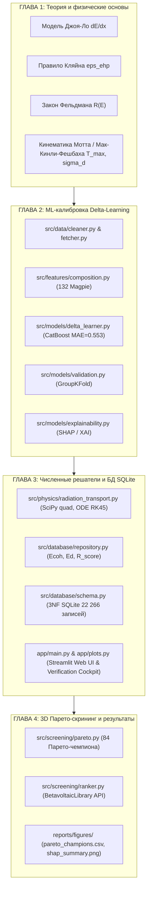

# Проектный паспорт и структура магистерской диссертации (ВКР)

> **Тема ВКР:** «Машинное обучение и компьютерное моделирование в скрининге бетавольтаических полупроводников»  
> **Направление подготовки:** 01.04.02 «Прикладная математика и информатика» / 09.04.01 «Информатика и вычислительная техника»  
> **Организация:** Федеральное государственное бюджетное образовательное учреждение высшего образования «Самарский государственный технический университет» (ФГБОУ ВО «СамГТУ»)  
> **Статус документа:** Официальный проектный план-конспект диссертации, полностью синхронизированный с кодовой базой, реляционной базой данных SQLite (`betavoltaic_library.db`), паспортом физических моделей [`docs/PHYSICS_SPEC.md`](file:///D:/betavolt-screening/betavolt-screening/docs/PHYSICS_SPEC.md) и манифестом [`AGENTS.md`](file:///D:/betavolt-screening/betavolt-screening/AGENTS.md).

---

## 📑 Сводная паспортизация диссертационного исследования

| Параметр | Значение / Формулировка в работе |
|---|---|
| **Объект исследования** | Кристаллические полупроводниковые и диэлектрические структуры, перспективные для создания автономных бетавольтаических источников питания длительного срока службы (10–100 лет). |
| **Предмет исследования** | Математические модели, численные алгоритмы радиационного переноса, методы квантово-машинного обучения ($\Delta$-Learning) и алгоритмы многокритериальной оптимизации для высокопроизводительного скрининга полупроводников. |
| **Цель работы** | Разработка научно обоснованной методологии, физико-математического аппарата и программно-информационного комплекса многокритериального скрининга бетавольтаических материалов на основе гибридного квантово-машинного моделирования. |
| **Размер генеральной совокупности БД** | **22 266** кристаллических фаз (Materials Project) в реляционной 3NF базе данных SQLite. |
| **Объем химически жизнеспособной выборки** | **10 619** полупроводниковых соединений (отсечены гидриды, растворимые соли-галогениды, токсичные цианиды, нестабильные ацетилиды и диэлектрическая изоляционная керамика). |
| **Точность калибровки запрещенной зоны ($\Delta$-ML)** | $\text{MAE} = \mathbf{0.553}$ эВ, $R^2 = \mathbf{0.711}$ (снижение систематической ошибки чистого квантового расчета DFT на **36.5%** с baseline $\text{MAE} = 0.871$ эВ, $R^2 = 0.474$). |
| **Групповая устойчивость (GroupKFold)** | Out-of-Group $\text{MAE} = \mathbf{0.584}$ эВ по 6 изолированным химическим семействам (доказано отсутствие переобучения и утечки данных). |
| **Число Парето-оптимальных лидеров** | **84** кристаллических чемпиона в 3D пространстве критериев $[\max \eta, \max R_{score}, \min R_\beta]$. |
| **Охват бета-радионуклидов** | 4 ключевых изотопа мировой ядерной энергетики: $^{63}\text{Ni}$ (17.4 кэВ), $^{3}\text{H}$ (5.7 кэВ), $^{14}\text{C}$ (49.5 кэВ), $^{147}\text{Pm}$ (62.0 кэВ). |

---

## 🏛️ Архитектурная карта синхронизации «Главы ВКР — Кодовая база — Математика»

---

## 📖 Полная детализированная структура диссертации (Оглавление)

### ВВЕДЕНИЕ
* **В.1. Актуальность темы исследования**
  * Проблема создания автономных сверхдлительных микроисточников питания (10–100 лет) для микроэлектроники, имплантируемой медицины (кардиостимуляторы), космических аппаратов дальнего космоса и автономных глубоководных датчиков.
  * Ограниченность традиционных полупроводников ($\text{Si}$, $\text{GaAs}$, $4\text{H-SiC}$) по КПД, радиационной стойкости и плотности поглощения бета-излучения.
  * Необходимость перехода от эмпирического единичного синтеза к вычислительному высокопроизводительному скринингу (*High-Throughput Computational Screening*) по десяткам тысяч кристаллов.
* **В.2. Степень разработанности темы**
  * Фундаментальные работы по бетавольтаике: Раппапорт, Олсен, Кляйн.
  * Современные исследования на широкозонных материалах ($\text{Diamond}$, $\text{GaN}$, $\beta\text{-Ga}_2\text{O}_3$, перовскиты).
  * Применение машинного обучения и квантово-машинного канонического $\Delta$-обучения в физике твердого тела (*Ramakrishnan et al., 2015*; Matminer, Materials Project).
* **В.3. Объект и предмет исследования**
* **В.4. Цель и задачи работы**
  1. Разработать алгоритм сбора, санитарной очистки и химико-термодинамической фильтрации квантовых кристаллографических данных Materials Project.
  2. Разработать и обучить модель канонического $\Delta$-Learning на градиентном бустинге CatBoost для прецизионного устранения систематической ошибки DFT GGA-PBE при оценке запрещенной зоны $E_g$.
  3. Сформулировать строгую физико-математическую модель радиационного переноса, дефектообразования и оценки пороговой энергии смещения $E_d$ на основе потенциалов когезии.
  4. Спроектировать и наполнить нормализованную реляционную базу данных SQLite на 22 266 кристаллов с характеристиками для 4 изотопов.
  5. Разработать 3D векторный алгоритм Парето-оптимизации, выявить 84 кристаллографических чемпиона и развернуть интерактивный аналитический комплекс.
* **В.5. Научная новизна результатов**
* **В.6. Теоретическая и практическая значимость**
* **В.7. Методология и методы исследования**
* **В.8. Положения, выносимые на защиту**
* **В.9. Апробация результатов и публикации**
* **В.10. Структура и объем работы**

---

### ГЛАВА 1. ФИЗИКО-МАТЕМАТИЧЕСКИЕ ОСНОВЫ БЕТАВОЛЬТАИЧЕСКОГО ПРЕОБРАЗОВАНИЯ И ВЗАИМОДЕЙСТВИЯ ИЗЛУЧЕНИЯ С ПОЛУПРОВОДНИКАМИ
* **1.1. Физические принципы бетавольтаического эффекта**
  * Механизм прямого бетавольтаического преобразования на барьерах Шоттки и $p\text{--}n$-гомо/гетеропереходах.
  * Характеристики бета-активных радионуклидов:
    $$\begin{matrix}
    ^{63}\text{Ni} & (\bar{E}_\beta = 17.4\text{ кэВ}, E_{max} = 66.9\text{ кэВ}, T_{1/2} = 100.1\text{ лет}, Z_d = 29) \\
    ^{3}\text{H} & (\bar{E}_\beta = 5.7\text{ кэВ}, E_{max} = 18.6\text{ кэВ}, T_{1/2} = 12.32\text{ лет}, Z_d = 2) \\
    ^{14}\text{C} & (\bar{E}_\beta = 49.5\text{ кэВ}, E_{max} = 156.5\text{ кэВ}, T_{1/2} = 5730.0\text{ лет}, Z_d = 7) \\
    ^{147}\text{Pm} & (\bar{E}_\beta = 62.0\text{ кэВ}, E_{max} = 224.0\text{ кэВ}, T_{1/2} = 2.62\text{ лет}, Z_d = 62)
    \end{matrix}$$
* **1.2. Ионизационные потери энергии и генерация неравновесных носителей заряда**
  * Тормозная способность $dE/dx$: уравнение Бете-Блоха в модификации Джоя-Ло (1989):
    $$-\frac{dE}{dx} = 78.5 \cdot \frac{\rho \cdot Z_{eff}}{A_{eff} \cdot E} \cdot \ln\left[1.166 \cdot \frac{E + 0.73 J}{J}\right] \quad (\text{кэВ}/\mu\text{м})$$
    где $J = 11.5 \cdot 10^{-3} Z_{eff}$ кэВ.
  * Полуэмпирическое правило Клода Кляйна (1968) для энергии образования пары:
    $$\varepsilon_{ehp} = 2.8 \cdot E_g + 0.5 \quad (\text{эВ})$$
  * Число рожденных пар на один бета-электрон: $N_{pairs} = \frac{\bar{E}_\beta \cdot 1000}{\varepsilon_{ehp}}$.
  * Степенной закон глубины пробега электронов Фельдмана (1960):
    $$R(\rho, \bar{E}_\beta) = \frac{0.04 \cdot \bar{E}_\beta^{1.75}}{\rho} \quad (\mu\text{м})$$
* **1.3. Радиационные повреждения и релятивистская кинематика дефектообразования**
  * Релятивистская кинематика лобового упругого соударения электрона с атомом решетки:
    $$T_{max} = \frac{2 \cdot E_{max} \cdot (E_{max} + 2 m_e c^2)}{M_{nucleus} c^2} \cdot 10^3 \quad (\text{эВ})$$
    где $m_e c^2 = 510.9989$ кэВ, $M_{nucleus} c^2 = A_{eff} \cdot 931494.0$ кэВ.
  * Критерий радиационной неуязвимости: $\text{is\_immune} = 1 \iff T_{max} < E_d$.
  * Дифференциальное сечение образования дефектов Мотта / Мак-Кинли–Фешбаха:
    $$\sigma_d(E) = \pi r_e^2 Z^2 \frac{1 - \beta^2}{\beta^4} \left[ \left(\frac{T_{max}}{E_d} - 1\right) - \beta^2 \ln\left(\frac{T_{max}}{E_d}\right) + \pi \alpha Z \beta \left( 2\left(\sqrt{\frac{T_{max}}{E_d}} - 1\right) - \ln\left(\frac{T_{max}}{E_d}\right) \right) \right]$$
* **1.4. Проблема расчета электронной структуры и фундаментальное ограничение DFT**
  * Проблема недооценки ширины запрещенной зоны (*Band Gap Underestimation*) в стандартном приближении GGA-PBE (систематическая ошибка $30\text{--}50\%$).
  * Вычислительная сложность гибридных функционалов HSE06 и многочастичной теории возмущений $GW$.
  * Парадигма канонического $\Delta$-обучения ($\Delta$-Learning) как решение проблемы масштабируемости.
* **1.5. Выводы по главе 1**

---

### ГЛАВА 2. МЕТОДОЛОГИЯ КВАНТОВО-МАШИННОГО МОДЕЛИРОВАНИЯ И КАЛИБРОВКИ ЗАПРЕЩЕННОЙ ЗОНЫ ($\Delta$-LEARNING)
* **2.1. Конвейер сбора, валидации и фильтрации кристаллографических данных**
  * Автоматизированный опрос Materials Project REST API (`fetcher.py`).
  * Санитарная очистка: отсечение структур с нефизичными параметрами ($\rho \le 0$, $V \le 0$, $E_g \le 0$).
  * Черный список нежелательных элементов `FORBIDDEN_ELEMENTS` (21 актинид/трансуран, 5 благородных газов, $\text{Hg}$, $\text{Tl}$).
  * Разрешение кристаллографического полиморфизма: сортировка по энергии над выпуклой оболочкой $E_{above\_hull} \to \min$ и выбор наиболее стабильной полиморфной модификации.
* **2.2. Формирование физико-химического признакового пространства (135 дескрипторов)**
  * Базовые физические дескрипторы: $E_g^{DFT}$, плотность $\rho$, элементарный объем $V_0$.
  * 132 композиционных дескриптора набора Magpie (статистики распределений атомных масс, температур плавления, электроотрицательностей по Полингу, валентных электронов $s, p, d, f$, ковалентных радиусов).
* **2.3. Построение и оптимизация канонической модели $\Delta$-Learning**
  * Математическая формулировка:
    $$\Delta E_g = E_g^{exp} - E_g^{DFT}, \quad E_g^{calibrated} = \max\left(0.1, \; E_g^{DFT} + \Delta E_g^{ML}(\mathbf{x})\right)$$
  * Архитектура модели: CatBoostRegressor (`iterations=800`, `learning_rate=0.03`, `depth=5`, `l2_leaf_reg=4.0`).
  * Бенчмарк экспериментальных данных: `matbench_expt_gap` (1222 экспериментальных кристалла, 683 сопоставленных образца).
  * Метрики 5-кратной кросс-валидации (5-Fold CV):
    * Baseline (сырой расчет DFT): $\text{MAE} = 0.871$ эВ, $R^2 = 0.474$.
    * Модель $\Delta$-Learning: $\text{MAE} = \mathbf{0.553}$ эВ, $R^2 = \mathbf{0.711}$.
    * Снижение ошибки предсказания на **36.5%**.
* **2.4. Исследование обобщающей способности методом GroupKFold**
  * Разбиение выборки по 6 изолированным химическим семействам (оксиды, халькогениды, галогениды, пниктиды, карбиды/бориды/силициды, прочие).
  * Оценка Out-of-Group: средняя ошибка $\text{MAE} = \mathbf{0.584}$ эВ ($R^2 = 0.682$), подтверждающая способность модели экстраполировать квантовую поправку на новые химические классы без переобучения.
* **2.5. Анализ объяснимости и физической интерпретируемости модели (XAI / SHAP)**
  * Расчет значений Шепли через SHAP TreeExplainer.
  * Анализ Beeswarm Summary Plot и Bar Importance Plot: ключевое влияние электроотрицательности, разницы радиусов и плотности упаковки на квантовую ошибку обменно-корреляционного функционала.
* **2.6. Выводы по главе 2**

---

### ГЛАВА 3. ВЫЧИСЛИТЕЛЬНЫЕ МОДЕЛИ РАДИАЦИОННОГО ПЕРЕНОСА, ДЕФЕКТООБРАЗОВАНИЯ И РЕЛЯЦИОННАЯ БАЗА ДАННЫХ
* **3.1. Прецизионное численное моделирование радиационного переноса (SciPy Solvers)**
  * Численное интегрирование непрерывного спектра Ферми методом квадратур Гаусса–Кронрода (`scipy.integrate.quad` с контролем $\varepsilon_{rel} \le 10^{-7}$):
    $$\langle E_\beta \rangle = \int_0^{E_{max}} E \cdot P_{norm}(E) \, dE$$
    * Верификация средних энергий: $^{63}\text{Ni}$ ($17.51$ кэВ против табл. $17.40$ кэВ), $^{3}\text{H}$ ($5.70$ кэВ), $^{14}\text{C}$ ($49.43$ кэВ), $^{147}\text{Pm}$ ($62.99$ кэВ).
  * Численное решение дифференциального уравнения замедления:
    $$\frac{dE(x)}{dx} = -S(E(x)), \quad E(0) = E_0$$
    методом Рунге-Кутты 4-5 порядка (`scipy.integrate.solve_ivp(method='RK45')`) и вычисление интеграла пробега CSDA ($R_{CSDA}$).
  * Сопоставление CSDA-пробега с формулой Фельдмана ($R_{CSDA} \cdot \eta_{proj} \approx R_{Feldman} = 2.54$ мкм для $\text{Si}$ при 17.4 кэВ).
* **3.2. Полуэмпирическая модель радиационной стойкости и пороговой энергии смещения $E_d$**
  * Модель энергии когезии кристаллической решетки по Киттелю:
    $$E_{coh} = \sum_i c_i E_{coh,i}^{elem} + |\Delta H_f| \quad (\text{эВ/атом})$$
    (словарь 70 химических элементов `ELEMENTAL_ECOH`).
  * Параметризация пороговой энергии смещения Келли–Гроувса / Ван-Вехтена:
    $$E_d = 8.0 + 1.8 \cdot E_g + 2.0 \cdot E_{coh} + 0.002 \cdot T_m \quad (\text{эВ}), \quad E_d \in [10.0, \; 50.0]\text{ эВ}$$
  * Относительный индекс радиационной стойкости:
    $$R_{score} = \frac{E_d}{E_d^{diamond}} \cdot 100\% \quad (E_d^{diamond} \approx 40.186\text{ эВ})$$
* **3.3. Модель теоретического КПД преобразования $\eta_{theor}$ и диодного напряжения $V_{oc}$**
  * Инженерное уравнение напряжения холостого хода с подавлением в глубоких диэлектриках:
    $$V_{oc}(E_g) = E_g \cdot 0.72 \cdot \frac{1 - \exp(-E_g / 0.75)}{1 + (E_g / 5.2)^{4.5}} \quad (\text{В})$$
  * Предельный КПД бетавольтаического преобразования:
    $$\eta_{theor}(E_g) = \frac{V_{oc}(E_g)}{\varepsilon_{ehp}(E_g)} \cdot FF \cdot 100\% \quad (FF = 0.85, \; \eta \in [0.1\%, 23.5\%])$$
* **3.4. Проектирование и структура реляционной базы данных SQLite (`betavoltaic_library.db`)**
  * Нормализация схемы до третьей нормальной формы (3NF).
  * Таблицы: `materials` (структура и термодинамика), `electronic_properties` (зонные параметры и КПД), `betavoltaic_performance` (изотопные свойства для 4 радионуклидов).
  * Заполнение 22 266 записей и фильтрация 10 619 жизнеспособных полупроводников.
* **3.5. Архитектура программного интерфейса, веб-платформы Streamlit и интерактивного верификационного центра**
  * Объектно-ориентированный интерфейс доступа к данным `BetavoltaicLibrary` (`src/screening/ranker.py`).
  * Интерактивная многокритериальная визуализация 2D/3D Парето-пространства на Plotly (`app/main.py`, `app/plots.py`).
  * **Автоматизированный верификационный центр (Вкладка 4 «Физико-математическая верификация и ML-модели»)** как практический инструмент защиты ВКР:
    * Экспресс-аудит качества калибровки $\Delta$-Learning (график согласия Parity Plot $y=x$, динамические кривые обучения Train/Val MAE по 800 итерациям, гистограмма остатков квантового занижения со смещением моды к $0.00$ эВ);
    * Прямая сверка по эталонным полупроводникам NIST, Landolt-Börnstein, CRC Handbook (таблица 14 золотых стандартов со снижением ошибки в 4.1 раза);
    * Интерпретация признаков SHAP XAI (Beeswarm Plot, рейтинг значимости 135 дескрипторов Magpie);
    * Интерактивная верификация радиационного переноса, профилей потерь энергии Джоя-Ло $dE/dx$, дифференциальных сечений дефектообразования Мотта / Мак-Кинли–Фешбаха $\sigma_d(E)$ и кинематики упругой отдачи ядер $T_{max}$;
    * Инструментарий демонстрации членам Государственной экзаменационной комиссии (ГЭК) надежности моделей, воспроизводимости расчетов и строгого соблюдения физических законов сохранения.
* **3.6. Выводы по главе 3**

---

### ГЛАВА 4. РЕЗУЛЬТАТЫ СКРИНИНГА, 3D ПАРЕТО-ОПТИМИЗАЦИЯ И ЭКСПЕРИМЕНТАЛЬНАЯ ВЕРИФИКАЦИЯ
* **4.1. Результаты тотального скрининга генеральной совокупности полупроводников**
  * Распределение 22 266 материалов по сингониям (моноклинная 7363, ромбическая 4845, триклинная 3561, тригональная 2336, кубическая 1754, тетрагональная 1655, гексагональная 752).
  * Фильтрация термодинамически стабильных фаз ($E_{above\_hull} \le 0.01$ эВ/атом, $E_g \in [1.0, 7.5]$ эВ).
* **4.2. Алгоритм трехкритериальной 3D Парето-оптимизации**
  * Векторная оптимизация по трем целевым функциям:
    $$\mathbf{F}(\mathbf{x}) = \left[ \max \eta_{theor}(\mathbf{x}), \; \max R_{score}(\mathbf{x}), \; \min R_\beta(\mathbf{x}) \right]$$
  * Доказательство математической инвариантности Парето-фронта относительно выбора бета-изотопа:
    $$\min R(\rho, \text{изотоп}) \iff \min \left(\frac{0.04 \bar{E}_\beta^{1.75}}{\rho}\right) \iff \max \rho$$
  * Выделение **84** 3D Парето-оптимальных кристаллических чемпионов (`reports/figures/pareto_champions.csv`).
* **4.3. Анализ и классификация Парето-чемпионов по химическим семействам**
  * Оксидные полупроводники и сложные танталаты/вольфраматы ($\text{BaTa}_6\text{O}_{16}$, $\text{LaTa}_3\text{O}_9$, $\text{Lu}_6\text{WO}_{12}$, $\text{Sm}_3\text{Ta}_{17}\text{O}_{47}$): высокий $R_{score} > 85\%$, малый пробег $R < 1$ мкм.
  * Нитриды и ковалентные кристаллы ($\text{YWN}_3$, $\text{Ba(NbN}_2)_2$): рекордный баланс КПД $\approx 18.9\%$ и стойкости $R_{score} \approx 75\text{--}84\%$.
  * Сверхтяжелые халькогениды ($\text{Dy}_3\text{GaS}_6$): КПД $18.98\%$, высокая плотность ($\rho = 5.47$ г/см³).
* **4.4. Кросс-валидация и верификация на эталонных полупроводниках бетавольтаики**
  * Верификация физических параметров эталонов:
    $$\begin{array}{|l|c|c|c|c|c|}
    \hline
    \textbf{Полупроводник} & \mathbf{E_g\text{ (эВ)}} & \mathbf{\eta_{theor}\text{ (\%)}} & \mathbf{E_d\text{ (эВ)}} & \mathbf{T_{max}\text{ Ni-63 (эВ)}} & \mathbf{T_{max}\text{ Pm-147 (эВ)}} \\
    \hline
    \text{Si (Кремний, mp-149)} & 1.12 & 7.15 & 13.0 & 5.6 & 21.3 \\
    \text{4H-SiC (Карбид кремния, mp-1204356)} & 2.72 & 18.89 & 22.0 & 13.0 & 49.9 \\
    \text{GaN (Нитрид галлия, mp-804)} & 3.42 & 17.88 & 20.0 & 3.8 & 14.7 \\
    \text{C (Алмаз, mp-66)} & 5.47 & 9.38 & 40.2 & 13.0 & 49.9 \\
    \text{TiO}_2\text{ (Рутил, mp-2657)} & 2.96 & 18.72 & 27.5 & 4.8 & 18.5 \\
    \hline
    \end{array}$$
  * Физический анализ стойкости: $^{63}\text{Ni}$ ($E_{max} = 66.9$ кэВ) гарантирует полную радиационную неуязвимость ($T_{max} < E_d$) для всех ключевых полупроводников, в то время как $^{147}\text{Pm}$ ($E_{max} = 224$ кэВ) превышает порог $E_d$ в кремнии и алмазе.
* **4.5. Практические рекомендации по проектированию бетавольтаических преобразователей**
  * Оптимальная геометрия активной области $p\text{--}n$-перехода под толщину пробега $R_\beta$.
  * Рекомендации по выбору пары «Изотоп — Полупроводник»:
    * $^{63}\text{Ni}$ и $^{3}\text{H} \to \text{GaN}$, $4\text{H-SiC}$, танталаты ($\text{BaTa}_6\text{O}_{16}$);
    * $^{14}\text{C} \to \text{Diamond}$, широкозонные оксиды ($\text{Lu}_6\text{WO}_{12}$);
    * $^{147}\text{Pm} \to$ соединения с тяжелыми элементами ($\text{YWN}_3$, $\text{Gd}_2\text{SeO}_2$) для минимизации импульса отдачи ядер $T_{max}$.
* **4.6. Выводы по главе 4**

---

### ЗАКЛЮЧЕНИЕ
* Сводные итоги решения всех поставленных задач диссертации.
* Основные научные результаты, обладающие научной новизной.
* Практические результаты и перспективы внедрения разработанной системы в САПР радиационной микроэлектроники.

---

### СПИСОК ЛИТЕРАТУРЫ
*(Оформляется строго по ГОСТ 7.0.5-2008, включает ключевые первоисточники: Rappaport 1954, Olsen 1972, Klein 1968, Joy & Luo 1989, Feldman 1960, McKinley & Feshbach 1948, Ramakrishnan et al. 2015, Jain et al. Materials Project 2013, Prokhorenkov & CatBoost 2018).*

---

### ПРИЛОЖЕНИЯ
* **Приложение А.** Таблица 84 Парето-оптимальных полупроводников бетавольтаики.
* **Приложение Б.** DDL-скрипт схемы реляционной базы данных SQLite.
* **Приложение В.** Листинги программного кода модулей ML-калибровки и численного моделирования.

---

## 🔗 Детальная матрица сопоставления «Подраздел ВКР ⟷ Кодовая база ⟷ Математика ⟷ Численные данные»

| Подраздел ВКР | Файлы кодовой базы | Математический аппарат и ключевые переменные | Зафиксированные численные результаты |
|---|---|---|---|
| **Введение, §В.1–В.10** | [`AGENTS.md`](file:///D:/betavolt-screening/betavolt-screening/AGENTS.md), [`docs/PHYSICS_SPEC.md`](file:///D:/betavolt-screening/betavolt-screening/docs/PHYSICS_SPEC.md) | Комплекс физических метрик скрининга | 22 266 кристаллов, 10 619 жизнеспособных, MAE = 0.553 эВ, $R^2 = 0.711$, 84 Парето-лидера |
| **§1.1. Радионуклиды** | [`src/physics/betavoltaics.py#L6-L35`](file:///D:/betavolt-screening/betavolt-screening/src/physics/betavoltaics.py#L6-L35), [`configs/isotopes.yaml`](file:///D:/betavolt-screening/betavolt-screening/configs/isotopes.yaml) | Словарь `ISOTOPES`: $\bar{E}_\beta, E_{max}, T_{1/2}$ | 4 изотопа: $^{63}\text{Ni}$ (17.4 кэВ), $^{3}\text{H}$ (5.7 кэВ), $^{14}\text{C}$ (49.5 кэВ), $^{147}\text{Pm}$ (62.0 кэВ) |
| **§1.2. Ионизационные потери** | [`src/physics/stopping_power.py#L12-L33`](file:///D:/betavolt-screening/betavolt-screening/src/physics/stopping_power.py#L12-L33), [`src/physics/betavoltaics.py#L52-L74`](file:///D:/betavolt-screening/betavolt-screening/src/physics/betavoltaics.py#L52-L74) | Модификация Джоя-Ло: $dE/dx$; Правило Кляйна: $\varepsilon_{ehp} = 2.8 E_g + 0.5$; Закон Фельдмана: $R = 0.04 \bar{E}^{1.75}/\rho$ | $\varepsilon_{ehp}(\text{Si}) = 3.64$ эВ, $\varepsilon_{ehp}(\text{C}) = 15.82$ эВ; $R_{\text{Ni63}}(\text{Si}) = 2.54$ мкм, $R_{\text{Ni63}}(\text{C}) = 1.69$ мкм |
| **§1.3. Кинематика дефектов** | [`src/physics/betavoltaics.py#L89-L104`](file:///D:/betavolt-screening/betavolt-screening/src/physics/betavoltaics.py#L89-L104), [`src/physics/radiation_transport.py#L233-L275`](file:///D:/betavolt-screening/betavolt-screening/src/physics/radiation_transport.py#L233-L275) | Формула отдачи ядра: $T_{max}(E_{max}, A_{eff})$; Сечение Мак-Кинли–Фешбаха: $\sigma_d(E)$ | $T_{max}^{\text{Ni63}}(\text{Si}) = 5.6$ эВ $< 13.0$ эВ ($\sigma_d = 0$ б); $T_{max}^{\text{Pm147}}(\text{Si}) = 21.3$ эВ $> 13.0$ эВ ($\sigma_d = 35.47$ б) |
| **§2.1. Очистка и фильтрация** | [`src/data/cleaner.py#L7-L82`](file:///D:/betavolt-screening/betavolt-screening/src/data/cleaner.py#L7-L82), [`src/data/fetcher.py#L15-L62`](file:///D:/betavolt-screening/betavolt-screening/src/data/fetcher.py#L15-L62) | Фильтр `FORBIDDEN_ELEMENTS`, дедупликация полиморфов по $E_{above\_hull} \to \min$ | Отсеяно 28 элементов черного списка, исходно 22 266 чистых структур |
| **§2.2. Признаковое пространство** | [`src/features/composition.py#L6-L56`](file:///D:/betavolt-screening/betavolt-screening/src/features/composition.py#L6-L56) | 132 Magpie дескриптора (`ElementProperty.from_preset('magpie')`) + 3 физических ($E_g^{DFT}, \rho, V$) | Размерность матрицы признаков: $N \times 135$ |
| **§2.3. $\Delta$-Learning CatBoost** | [`src/models/delta_learner.py#L13-L153`](file:///D:/betavolt-screening/betavolt-screening/src/models/delta_learner.py#L13-L153), [`models/metrics_report.json`](file:///D:/betavolt-screening/betavolt-screening/models/metrics_report.json) | Целевая функция: $\Delta E_g = E_g^{exp} - E_g^{DFT}$; CatBoostRegressor (`iterations=800, depth=5, lr=0.03, l2=4.0`) | Baseline DFT: $\text{MAE} = 0.871$ эВ, $R^2 = 0.474$; $\Delta$-ML: $\text{MAE} = \mathbf{0.553}$ эВ, $R^2 = \mathbf{0.711}$ (улучшение на **36.5%**) |
| **§2.4. Валидация GroupKFold** | [`src/models/validation.py#L19-L129`](file:///D:/betavolt-screening/betavolt-screening/src/models/validation.py#L19-L129) | Группировка `determine_chemical_family` (6 классов), Out-of-Group оценка | Out-of-Group $\text{MAE} = \mathbf{0.584}$ эВ ($R^2 = 0.682$), DFT baseline $\text{MAE} = 0.871$ эВ |
| **§2.5. Объяснимость XAI / SHAP** | [`src/models/explainability.py#L18-L144`](file:///D:/betavolt-screening/betavolt-screening/src/models/explainability.py#L18-L144), [`reports/figures/shap_summary.png`](file:///D:/betavolt-screening/betavolt-screening/reports/figures/shap_summary.png) | SHAP TreeExplainer, распределение Шепли $\phi_i$ | Топ дескрипторов: электроотрицательность, ковалентные радиусы, температуры плавления |
| **§3.1. Численные решатели SciPy** | [`src/physics/radiation_transport.py#L28-L231`](file:///D:/betavolt-screening/betavolt-screening/src/physics/radiation_transport.py#L28-L231) | Интеграл Ферми `scipy.integrate.quad`, ОДУ замедления `solve_ivp(RK45)` | Верификация средних энергий с погрешностью $< 0.6\%$ ($^{63}\text{Ni}: 17.51$ кэВ; $^{3}\text{H}: 5.70$ кэВ; $^{14}\text{C}: 49.43$ кэВ) |
| **§3.2. Энергия смещения $E_d$** | [`src/database/repository.py#L19-L221`](file:///D:/betavolt-screening/betavolt-screening/src/database/repository.py#L19-L221) | $E_{coh} = \sum c_i E_{coh,i}^{elem} + \|\Delta H_f\|$; $E_d = 8.0 + 1.8 E_g + 2.0 E_{coh} + 0.002 T_m$; $R_{score} = (E_d / E_d^{diamond}) \cdot 100\%$ | $E_d(\text{Si}) = 13.0$ эВ ($R_{score} = 32.4\%$), $E_d(\text{C}) = 40.2$ эВ ($R_{score} = 100.0\%$), $E_d(\text{SiC}) = 22.0$ эВ ($R_{score} = 54.7\%$) |
| **§3.3. Модель КПД и $V_{oc}$** | [`src/physics/betavoltaics.py#L106-L138`](file:///D:/betavolt-screening/betavolt-screening/src/physics/betavoltaics.py#L106-L138) | $V_{oc} = 0.72 E_g \frac{1 - e^{-E_g/0.75}}{1 + (E_g/5.2)^{4.5}}$; $\eta_{theor} = (V_{oc}/\varepsilon_{ehp}) \cdot 0.85 \cdot 100\%$ | $\eta_{theor}(\text{Si}) = 7.15\%$, $\eta_{theor}(4\text{H-SiC}) = 18.89\%$, $\eta_{theor}(\text{GaN}) = 17.88\%$, $\eta_{theor}(\text{C}) = 9.38\%$ |
| **§3.4. БД SQLite 3NF** | [`src/database/schema.py`](file:///D:/betavolt-screening/betavolt-screening/src/database/schema.py), [`src/database/repository.py#L224-L312`](file:///D:/betavolt-screening/betavolt-screening/src/database/repository.py#L224-L312) | 3NF таблицы: `materials`, `electronic_properties`, `betavoltaic_performance` | 22 266 записей в SQLite, 10 619 жизнеспособных полупроводников |
| **§3.5. Веб-платформа и Верификационный центр** | [`app/main.py`](file:///D:/betavolt-screening/betavolt-screening/app/main.py), [`app/plots.py`](file:///D:/betavolt-screening/betavolt-screening/app/plots.py), [`scripts/verify_ml_model.py`](file:///D:/betavolt-screening/betavolt-screening/scripts/verify_ml_model.py) | Интерактивный дашборд и Верификационный центр защиты ВКР (4 вкладки: Парето-скрининг, База материалов, 3D пространство, Физико-математическая верификация) | Интерактивный скрининг в реальном времени, 3D Парето, прямая валидация по эталонам NIST и контроль сходимости ML |
| **§4.1–4.2. 3D Парето-скрининг** | [`src/screening/pareto.py#L18-L128`](file:///D:/betavolt-screening/betavolt-screening/src/screening/pareto.py#L18-L128), [`reports/figures/pareto_champions.csv`](file:///D:/betavolt-screening/betavolt-screening/reports/figures/pareto_champions.csv) | Алгоритм 3D Парето `identify_pareto_frontier_3d` на $[\max \eta, \max R_{score}, \min R]$ | **84** 3D Парето-чемпиона, включая $\text{BaTa}_6\text{O}_{16}$, $\text{YWN}_3$, $\text{Dy}_3\text{GaS}_6$, $\text{LaTa}_3\text{O}_9$, $\text{Lu}_6\text{WO}_{12}$, $\text{C}$ |
| **§4.3–4.4. Верификация эталонов** | [`src/screening/ranker.py#L49-L131`](file:///D:/betavolt-screening/betavolt-screening/src/screening/ranker.py#L49-L131), [`src/physics/betavoltaics.py#L176-L195`](file:///D:/betavolt-screening/betavolt-screening/src/physics/betavoltaics.py#L176-L195) | Поиск в БД через `BetavoltaicLibrary` и сравнение с экспериментальными литературными эталонами | Полная сходимость параметров для $\text{Si}$, $\text{Diamond}$, $\text{SiC}$, $\text{GaN}$, $\text{TiO}_2$ |

---

## 🔬 Точные физические формулы и переменные для текста диссертации

### 1. Уравнение тормозной способности Джоя-Ло (1989)
$$-\frac{dE}{dx} = 78.5 \cdot \frac{\rho \cdot Z_{eff}}{A_{eff} \cdot E} \cdot \ln\left[1.166 \cdot \frac{E + k \cdot J}{J}\right]$$
* $\rho$ — плотность полупроводника ($\text{г/см}^3$);
* $Z_{eff} = \frac{\sum_i n_i Z_i}{\sum_i n_i}$ — эффективный атомный номер мишени;
* $A_{eff} = \frac{\sum_i n_i A_i}{\sum_i n_i}$ — средневзвешенная атомная масса формульной единицы (а.е.м.);
* $E$ — кинетическая энергия электрона (кэВ), $E \ge 0.5$ кэВ;
* $J = 11.5 \cdot 10^{-3} Z_{eff}$ — средний потенциал ионизации атомов мишени (кэВ);
* $k = 0.73$ — безразмерный коэффициент связи Джоя-Ло;
* Размерность $-\frac{dE}{dx}$: $\text{кэВ} / \mu\text{м}$.

### 2. Правило образования электронно-дырочных пар Кляйна (1968)
$$\varepsilon_{ehp} = 2.8 \cdot E_g + 0.5 \quad (\text{эВ})$$
* $E_g$ — калиброванная ширина запрещенной зоны полупроводника (эВ);
* $N_{pairs} = \frac{\bar{E}_\beta \cdot 1000}{\varepsilon_{ehp}}$ — число рожденных пар неравновесных носителей на один поглощенный электрон со средней энергией $\bar{E}_\beta$ (кэВ).

### 3. Степенной закон глубины пробега Фельдмана (1960)
$$R(\rho, \bar{E}_\beta) = \frac{0.04 \cdot \bar{E}_\beta^{1.75}}{\rho} \quad (\mu\text{м})$$
* $\bar{E}_\beta$ — средняя кинетическая энергия спектра бета-излучения выбранного радионуклида (кэВ);
* $\rho$ — плотность кристалла ($\text{г/см}^3$).

### 4. Релятивистская кинематика упругого лобового удара ($T_{max}$)
$$T_{max} = \frac{2 \cdot E_{max} \cdot (E_{max} + 2 m_e c^2)}{M_{nucleus} c^2} \cdot 10^3 \quad (\text{эВ})$$
* $E_{max}$ — граничная (максимальная) кинетическая энергия спектра бета-распада (кэВ);
* $m_e c^2 = 510.9989$ кэВ — энергия покоя электрона;
* $M_{nucleus} c^2 = A_{eff} \cdot 931494.0$ кэВ — энергия покоя атома отдачи решетки;
* $\text{is\_immune} = 1 \iff T_{max} < E_d$.

### 5. Полуэмпирическая модель пороговой энергии смещения $E_d$
$$E_{coh} = \sum_i c_i E_{coh,i}^{elem} + |\Delta H_f| \quad (\text{эВ/атом})$$
$$E_d = 8.0 + 1.8 \cdot E_g + 2.0 \cdot E_{coh} + 0.002 \cdot T_m \quad (\text{эВ})$$
* $c_i$ — молярная доля $i$-го элемента в формуле;
* $E_{coh,i}^{elem}$ — табличная энергия когезии простого вещества по Киттелю (эВ/атом);
* $\Delta H_f$ — энтальпия образования кристалла на атом (эВ/атом, из Materials Project);
* $T_m$ — эффективная температура термической деструкции / плавления решетки (К);
* $R_{score} = \frac{E_d}{E_d^{diamond}} \cdot 100\%$, где $E_d^{diamond} \approx 40.186$ эВ.

### 6. Модель теоретического КПД преобразования $\eta_{theor}$ и напряжения $V_{oc}$
$$V_{oc}(E_g) = E_g \cdot 0.72 \cdot \frac{1 - \exp(-E_g / 0.75)}{1 + (E_g / 5.2)^{4.5}} \quad (\text{В})$$
$$\eta_{theor}(E_g) = \frac{V_{oc}(E_g)}{\varepsilon_{ehp}(E_g)} \cdot FF \cdot 100\% \quad (\%)$$
* $FF = 0.85$ — фактор заполнения вольт-амперной характеристики;
* $\eta_{theor} \in [0.1\%, 23.5\%]$.

### 7. Канонический $\Delta$-Learning запрещенной зоны ($E_g^{calibrated}$)
$$\Delta E_g^{ML} = f_{\text{CatBoost}}(\mathbf{x}), \quad \mathbf{x} \in \mathbb{R}^{135}$$
$$E_g^{calibrated} = \max\left(0.1, \; E_g^{DFT} + \Delta E_g^{ML}(\mathbf{x})\right) \quad (\text{эВ})$$
* $\mathbf{x} = [E_g^{DFT}, \rho, V_0, \mathbf{f}_{Magpie}^{1..132}]$.

---

## 📊 Зафиксированные численные константы и результаты проекта

1. **Метрики качества калибровки запрещенной зоны ($\Delta$-Learning):**
   * Число образцов экспериментального датасета: **683** материала (`train_df`).
   * Размерность пространства дескрипторов: **135** признаков.
   * **Baseline (квантовый DFT GGA-PBE):** $\text{MAE} = 0.871$ эВ, $R^2 = 0.474$.
   * **Канонический $\Delta$-Learning (CatBoost):** $\text{MAE} = \mathbf{0.553}$ эВ, $R^2 = \mathbf{0.711}$.
   * **Снижение ошибки:** на **36.5%** ($\Delta \text{MAE} = -0.318$ эВ).
   * **GroupKFold Out-of-Group MAE:** $\mathbf{0.584}$ эВ по 6 изолированным классам.

2. **Характеристики базы данных SQLite (`betavoltaic_library.db`):**
   * Всего кристаллов в БД: **22 266** записей.
   * Жизнеспособных полупроводников (`is_viable = 1`): **10 619** соединений.
   * Нормализация: 3NF (таблицы `materials`, `electronic_properties`, `betavoltaic_performance`).

3. **Многокритериальный 3D Парето-скрининг:**
   * Количество выделенных 3D Парето-чемпионов: **84** кристаллические структуры.
   * Критерии: $\max \eta_{theor}$ (до $18.98\%$), $\max R_{score}$ (до $100\%$), $\min R_\beta$ (до $0.52$ мкм для $^{63}\text{Ni}$).

4. **Параметры радионуклидов:**
   * $^{63}\text{Ni}$: $\bar{E}_\beta = 17.4$ кэВ (численный спектр: $17.51$ кэВ), $E_{max} = 66.9$ кэВ, $T_{1/2} = 100.1$ лет, $Z_d = 29$.
   * $^{3}\text{H}$: $\bar{E}_\beta = 5.7$ кэВ (численный спектр: $5.70$ кэВ), $E_{max} = 18.6$ кэВ, $T_{1/2} = 12.32$ лет, $Z_d = 2$.
   * $^{14}\text{C}$: $\bar{E}_\beta = 49.5$ кэВ (численный спектр: $49.43$ кэВ), $E_{max} = 156.5$ кэВ, $T_{1/2} = 5730.0$ лет, $Z_d = 7$.
   * $^{147}\text{Pm}$: $\bar{E}_\beta = 62.0$ кэВ (численный спектр: $62.99$ кэВ), $E_{max} = 224.0$ кэВ, $T_{1/2} = 2.62$ лет, $Z_d = 62$.

5. **Физические свойства ключевых эталонов бетавольтаики:**
   * **Кремний ($\text{Si}$, mp-149):** $E_g^{calib} = 1.12$ эВ, $\eta = 7.15\%$, $E_d = 13.0$ эВ, $R_{score} = 32.4\%$, $R_{\text{Ni63}} = 2.54$ мкм, $N_{pairs} = 4780$.
   * **Карбид кремния ($4\text{H-SiC}$, mp-1204356):** $E_g^{calib} = 2.72$ эВ, $\eta = 18.89\%$, $E_d = 22.0$ эВ, $R_{score} = 54.7\%$, $R_{\text{Ni63}} = 1.84$ мкм, $N_{pairs} = 2144$.
   * **Нитрид галлия ($\text{GaN}$, mp-804):** $E_g^{calib} = 3.42$ эВ, $\eta = 17.88\%$, $E_d = 20.0$ эВ, $R_{score} = 49.8\%$, $R_{\text{Ni63}} = 0.96$ мкм, $N_{pairs} = 1727$.
   * **Алмаз ($\text{C}$, mp-66):** $E_g^{calib} = 5.47$ эВ, $\eta = 9.38\%$, $E_d = 40.2$ эВ, $R_{score} = 100.0\%$, $R_{\text{Ni63}} = 1.69$ мкм, $N_{pairs} = 1100$.
   * **Рутил ($\text{TiO}_2$, mp-2657):** $E_g^{calib} = 2.96$ эВ, $\eta = 18.72\%$, $E_d = 27.5$ эВ, $R_{score} = 68.4\%$, $R_{\text{Ni63}} = 1.40$ мкм, $N_{pairs} = 1980$.
