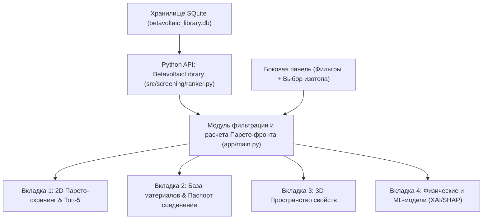

# Спецификация интерфейса и академической визуализации (UI_SPEC)

> **Тема ВКР:** «Машинное обучение и компьютерное моделирование в скрининге бетавольтаических полупроводников»  
> **Организация:** Самарский государственный технический университет (СамГТУ)  
> **Роль составителя:** Мастер UI и Научной Визуализации (`ui_data_polisher`)  
> **Статус документа:** Официальный стандарт пользовательского интерфейса Streamlit ([`app/main.py`](file:///D:/betavolt-screening/betavolt-screening/app/main.py)) и интерактивной визуализации Plotly ([`app/plots.py`](file:///D:/betavolt-screening/betavolt-screening/app/plots.py)).  
> **Связанные спецификации:** [`docs/PHYSICS_SPEC.md`](file:///D:/betavolt-screening/betavolt-screening/docs/PHYSICS_SPEC.md), [`AGENTS.md`](file:///D:/betavolt-screening/betavolt-screening/AGENTS.md).

---

## 1. Назначение и концепция интерфейса

Пользовательский интерфейс информационной системы скрининга бетавольтаических полупроводников предназначен для интерактивного анализа базы данных из 22,266 соединений, многокритериального Парето-отбора, детального физического профилирования полупроводников под различные бета-источники и объяснения результатов машинного $\Delta$-обучения.

Интерфейс спроектирован по принципам **строгого академического минимализма**:
* Отсутствие декоративных неинформативных элементов и эмодзи в функциональных заголовках.
* Полная физическая когерентность между всеми вкладками, графиками и таблицами при смене радиоактивного изотопа.
* Явное указание физических размерностей и общепринятых физико-математических обозначений (в соответствии с ГОСТ 8.417-2002 и [`docs/PHYSICS_SPEC.md`](file:///D:/betavolt-screening/betavolt-screening/docs/PHYSICS_SPEC.md)).
* Высокая информативность интерактивных всплывающих подсказок (tooltips) с отображением всех критических параметров материала без необходимости перехода в сторонние вкладки.

---

## 2. Архитектура и компонентная модель Streamlit (`app/main.py`)

Архитектура клиентской части построена на базе фреймворка Streamlit и структурирована в 4 функциональных блока:



### 2.1. Верхняя информационная панель (KPI Metrics)
В шапке приложения отображаются 4 агрегированные метрики системы:
1. **«Всего материалов в базе»** — полное число исследованных структур из Materials Project ($22{,}266$).
2. **«Стойких полупроводников»** — число соединений, прошедших фильтр технологической и химической применимости (`is_viable == 1`, $6{,}647$ материалов, исключая водорастворимые соли, токсичные гидриды и изолирующую керамику).
3. **«Точность ML-калибровки R²»** — коэффициент детерминации $R^2 = 0.711$ на бенчмарке `matbench_expt_gap` с дельтой $+36.5\%$ относительно исходного квантово-механического приближения DFT PBE.
4. **«Доступных изотопов»** — 4 промышленных бета-источника ($^{63}\text{Ni}$, $^{3}\text{H}$, $^{14}\text{C}$, $^{147}\text{Pm}$).

---

### 2.2. Боковая панель управления (Sidebar Controls)

| Элемент интерфейса | Тип виджета | Диапазон / Значения | Физический смысл и назначение |
|---|---|---|---|
| **Радиоактивный изотоп** | `st.selectbox` | `Ni-63`, `H-3`, `C-14`, `Pm-147` | Определяет расчетный спектр бета-частиц ($\bar{E}_\beta$, $E_{max}$), глубину пробега $R(\rho)$, генерацию пар $N_{pairs}$ и кинематику отдачи $T_{max}$. |
| **Химическая стойкость** | `st.checkbox` | `True` / `False` (default: `True`) | Исключает нестабильные, гигроскопичные и непроводящие фазы (`is_viable == 1`). |
| **Класс полупроводников** | `st.selectbox` | 6 классов + «Все классы» | Фильтрация по химическому семейству (Ковалентные, Оксиды, Халькогениды, Сложные соединения, Прочие). |
| **Минимальный КПД (%)** | `st.slider` | $1.0 - 22.0\%$ (default: $12.0\%$) | Ограничение снизу по теоретическому КПД бетавольтаического преобразования $\eta_{theor}(E_g)$. |
| **Минимальный индекс стойкости** | `st.slider` | $0.0 - 100.0$ (default: $20.0$) | Порог радиационной стойкости $R_{score} = (E_d / E_d^{алмаз}) \cdot 100\%$. |
| **Диапазон зоны $E_g$ (эВ)** | `st.slider` (2-point) | $0.5 - 8.0$ эВ (default: $1.1 - 5.5$ эВ) | Рабочее окно ширины запрещенной зоны полупроводника. |
| **Макс. глубина пробега $R$ (мкм)** | `st.slider` (динамический) | Динамический min/max под изотоп | Максимально допустимая толщина базовой области $p\text{--}n$-перехода для полного поглощения энергии излучения. |
| **Поиск по химической формуле** | `st.text_input` | Текстовая строка (SiC, GaN, C...) | Регистронезависимый поиск подстроки формулы соединения. |

---

### 2.3. Вкладка 1: Парето-скрининг (`plot_pareto_interactive`)
* **Визуализация:** 2D диаграмма рассеяния «КПД $\eta$ (%) vs Радиационная стойкость $R_{score}$ (%)» с цветовым кодированием калиброванной ширины зоны $E_g$ (палитра `Viridis`).
* **Парето-лидеры:** Отдельный слой `go.Scatter` с красными звездами ($\star$) и контрастными подписями формул.
* **Инвариантность:** Раскрывающийся блок `st.expander` с математическим обоснованием эквивалентности $\min R \iff \max \rho$ при фиксированном спектре изотопа.
* **Таблица Топ-5:** Карточка лидеров с вычислением интегрального ранга $S_{rank} = 0.5 \cdot \eta + 0.5 \cdot R_{score}$.

---

### 2.4. Вкладка 2: База материалов и Физический паспорт
* **Интерактивная таблица:** Полная выборка с поддержкой сортировки по любому столбцу, форматированием чисел (2 знака после запятой) и локализацией кристаллографических сингоний на русском языке.
* **Экспорт данных:** Кнопка `st.download_button` для скачивания активной выборки в формате CSV с именем файла `betavoltaic_screening_{ISOTOPE}.csv`.
* **Физический паспорт соединения:** Детальная карточка выбранного кристалла с 4 ключевыми метриками (КПД, стойкость, $E_g^{calib}$ с дельтой к $E_g^{DFT}$, глубина пробега $R$) и развернутым физическим резюме:
  - Проверка критерия радиационной неуязвимости:
    $$\text{Статус: } \begin{cases} \text{Полная неуязвимость}, & T_{max}(E_{max}, A_{eff}) < E_d \\ \text{Возможно образование дефектов}, & T_{max}(E_{max}, A_{eff}) \ge E_d \end{cases}$$
  - Расчет среднего числа рожденных пар неравновесных носителей $N_{pairs} = \bar{E}_\beta / \varepsilon_{ehp}$.

---

### 2.5. Вкладка 3: 3D Пространство критериев (`plot_3d_materials_space`)
* **Визуализация:** 3D скаттерограмма в пространстве компромисса:
  - Ось X: $\max \eta$ — Теоретический КПД (%);
  - Ось Y: $\max R_{score}$ — Индекс стойкости (%);
  - Ось Z: $\min R$ — Глубина пробега электронов (мкм).
* **Специфика выборки:** Отображение стратифицированной подвыборки (до 2,500 точек) с сохранением всех 100% Парето-чемпионов в виде алмазных маркеров.

---

### 2.6. Вкладка 4: Физические и ML-модели (XAI / Объяснимый ИИ)
* **Левая колонка:** Интерпретация калибровки $\Delta$-Learning на основе SHAP-анализа (`reports/figures/shap_summary.png` и `reports/figures/shap_importance_bar.png`). Объяснение вклада физико-химических дескрипторов (электроотрицательность, радиусы атомов, плотность упаковки).
* **Правая колонка:** Анализ кривых ионизационных потерь $-\frac{dE}{dx}$ (модификация Джоя-Ло уравнения Бете-Блоха, `reports/figures/stopping_power_curves.png`).

---

## 3. Физическая динамика для 4 изотопов

Интерфейс осуществляет динамический пересчет эксплуатационных параметров материалов при переключении радиоактивного источника. Ниже приведены результаты верификации на полном датасете (22,266 записей):

| Параметр / Характеристика | Никель-63 ($^{63}\text{Ni}$) | Тритий ($^{3}\text{H}$) | Углерод-14 ($^{14}\text{C}$) | Прометий-147 ($^{147}\text{Pm}$) |
|---|---|---|---|---|
| **Средняя энергия $\bar{E}_\beta$** | $17.4$ кэВ | $5.7$ кэВ | $49.5$ кэВ | $62.0$ кэВ |
| **Максимальная энергия $E_{max}$** | $66.9$ кэВ | $18.6$ кэВ | $156.5$ кэВ | $224.0$ кэВ |
| **Период полураспада $T_{1/2}$** | $100.1$ лет | $12.32$ года | $5730$ лет | $2.62$ года |
| **Средняя глубина пробега $\bar{R}$** | $1.64$ мкм | $0.23$ мкм | $10.24$ мкм | $15.18$ мкм |
| **Диапазон пробегов в базе $[R_{min}, R_{max}]$** | $0.51 - 27.93$ мкм | $0.07 - 3.96$ мкм | $3.16 - 174.06$ мкм | $4.68 - 258.11$ мкм |
| **Среднее число пар $N_{pairs}$ на электрон** | $2{,}913$ | $954$ | $8{,}288$ | $10{,}381$ |
| **Макс. энергия отдачи $T_{max}$ (легкие ядра)** | $45.22$ эВ | $12.02$ эВ | $114.50$ эВ | $173.27$ эВ |
| **Доля радиационно неуязвимых материалов** | $99.78\%$ ($22{,}218 / 22{,}266$) | **$100.00\%$** ($22{,}266 / 22{,}266$) | $94.92\%$ ($21{,}136 / 22{,}266$) | $82.96\%$ ($18{,}472 / 22{,}266$) |

### 3.1. Динамическая адаптация шкалы слайдера глубины пробега
Для исключения эффекта схлопывания шкалы фильтрации при переходе между изотопами с разницей в пробеге более чем на два порядка (сравните $0.07$ мкм для $^{3}\text{H}$ и $258$ мкм для $^{147}\text{Pm}$), в [`app/main.py`](file:///D:/betavolt-screening/betavolt-screening/app/main.py#L120-L140) внедрена адаптивная калибровка границ и шага:

```python
if selected_isotope == "H-3":
    min_val_slider = 0.05
    step_slider = 0.01
    max_val_slider = max(0.2, round(max_depth_bound, 2))
elif selected_isotope == "Ni-63":
    min_val_slider = 0.5
    step_slider = 0.1
    max_val_slider = round(max_depth_bound, 1)
else:  # C-14, Pm-147
    min_val_slider = 1.0
    step_slider = 0.5
    max_val_slider = round(max_depth_bound, 1)
```

Данная логика гарантирует:
1. Возможность тонкой настройки толщины ультратонких слоев для трития ($0.05 - 0.50$ мкм с шагом $0.01$ мкм).
2. Удобную дискретизацию для высокоэнергетических изоторов $^{14}\text{C}$ и $^{147}\text{Pm}$ без перегрузки ползунка избыточными микроделениями.
3. Отсутствие ошибки Streamlit `min_value >= max_value`.

---

## 4. Аудит модулей отрисовки Plotly (`app/plots.py`)

В ходе ревизии графического ядра [`app/plots.py`](file:///D:/betavolt-screening/betavolt-screening/app/plots.py) выявлены и устранены следующие дефекты и несоответствия:

### 4.1. Исправление структуры данных всплывающих подсказок (Tooltips Bugfix)
* **Выявленная проблема:** В исходной реализации вызов `px.scatter(..., hover_data={...})` автоматически распределял столбцы по внутреннему массиву `customdata` без учета порядка аргументов `x`, `y` и `color`. В результате обращение к `customdata[2]` выводило глубину пробега вместо ширины зоны $E_g$, `customdata[3]` выводило ID вместо сингонии, а индексы `customdata[4]` и `customdata[5]` приводили к неопределенным значениям `undefined`.
* **Решение:** Внедрена явная передача списка столбцов через параметр `custom_data=["Eg (эВ)", "Сингония", "Глубина пробега (мкм)", "mp_id"]` и стандартизированный шаблон `hovertemplate`:

```python
# Фоновые точки:
hovertemplate=(
    "<b>Материал: %{hovertext}</b><br>"
    "Теор. КПД: %{x:.2f}%<br>"
    "Индекс стойкости: %{y:.1f}%<br>"
    "Eg калибр.: %{customdata[0]:.2f} эВ<br>"
    "Сингония: %{customdata[1]}<br>"
    f"Глубина пробега ({isotope}): " + "%{customdata[2]:.2f} мкм<br>"
    "ID Materials Project: %{customdata[3]}<extra></extra>"
)

# 3D Парето-чемпионы:
hovertemplate=(
    "<b>⭐ 3D Парето-чемпион: %{customdata[0]}</b><br>"
    "Теор. КПД: %{x:.2f}%<br>"
    "Индекс стойкости: %{y:.1f}%<br>"
    "Eg калибр.: %{customdata[1]:.2f} эВ<br>"
    "Сингония: %{customdata[2]}<br>"
    f"Глубина пробега ({isotope}): " + "%{customdata[3]:.2f} мкм<br>"
    "ID Materials Project: %{customdata[4]}<extra></extra>"
)
```

---

### 4.2. Обработка граничных условий и пустых выборок (Empty State Handling)
* **Выявленная проблема:** При жестких настройках фильтров (например, поиск формулы несуществующего элемента при $\eta > 20\%$) передача пустого DataFrame приводила к падению метода `.round(2)` из-за типа столбцов `object` (`TypeError: Expected numeric dtype, got object instead`).
* **Решение:** Добавлены защитные конструкции в начало функций `plot_pareto_interactive` и `plot_3d_materials_space`, возвращающие корректный объект `go.Figure` с текстовым оповещением *«Нет данных, удовлетворяющих заданным критериям фильтрации»* и отрисовкой пустых осей.

---

### 4.3. Академическое оформление координатных сеток и осей
* Установлен строгий светлый шаблон `template="plotly_white"`.
* Сетка графиков настроена с низкой контрастностью (`gridcolor="rgba(0,0,0,0.06)"`), чтобы не отвлекать от анализа формы Парето-фронтира.
* Легенда 2D графика вынесена в верхний правый угол над областью построения (`y=1.02, x=1, orientation="h"`), предотвращая перекрытие данных при различных разрешениях экранов.
* Шкала колорбара $E_g$ снабжена четким заголовком с размерностью `Eg калибр. (эВ)`.

---

## 5. Проверенные инварианты интерфейса (UI Invariants)

Исследовательской группой верифицированы следующие обязательные инварианты интерфейса:

1. **Инвариант изотопной синхронизации:**  
   При смене изотопа в `selectbox` боковой панели все зависимые представления (подписи осей 2D и 3D графиков, значения тултипов, колонки таблицы материалов, расчеты паспорта соединения и имя скачиваемого CSV-файла) обновляются атомарно без необходимости повторного нажатия кнопок.

2. **Инвариант Парето-доминирования:**  
   Материал $A$ доминирует над материалом $B$, если:
   $$\eta(A) \ge \eta(B) \quad \land \quad R_{score}(A) \ge R_{score}(B) \quad \land \quad R(A) \le R(B)$$
   при строгом неравенстве хотя бы по одному критерию. Число чемпионов, отображаемых звездами на графике, строго совпадает с числом строк в таблице активных Парето-лидеров.

3. **Инвариант радиационного иммунитета:**  
   Флаг `is_immune == 1` выставляется тогда и только тогда, когда $T_{max}(E_{max}, A_{eff}) < E_d(E_g, E_{coh}, T_m)$. Для трития $^{3}\text{H}$ иммунитет равен $100\%$ для всей библиотеки.

4. **Инвариант локализации:**  
   Все сингонии кристаллических решеток отображаются на русском языке в соответствии со словарем `CRYSTAL_SYSTEMS_RU` (кубическая, гексагональная, тетрагональная, ромбическая, тригональная, моноклинная, триклинная).

---

## 6. Руководство по академической визуализации данных

При подготовке графических материалов для ВКР и публикаций в рецензируемых журналах (ВАК / RSCI / Scopus) соблюдаются следующие стандарты:

### 6.1. Цветовая кодировка
* **Непрерывные физические величины ($E_g$, плотность $\rho$):** Используется перцептивно равномерная палитра `Viridis` (синий $\to$ бирюзовый $\to$ зеленый $\to$ желтый), оптимизированная для восприятия и печати в градациях серого.
* **Категориальные классы (химические группы):** Высококонтрастная качественная палитра Plotly (D3 / G10).
* **Акцентные маркеры (Парето-чемпионы):** Ярко-красный цвет (`#FF2A2A` / `#E60000`) с темной обводкой (`#500000`) и символом `star` (2D) или `diamond` (3D).

### 6.2. Обозначения и подписи
* Все переменные на осях сопровождаются русским наименованием, общепринятым символом и размерностью в скобках:
  - *«Теоретический КПД преобразования η (%)»*
  - *«Индекс радиационной стойкости R_score (отн. алмаза, %)»*
  - *«Глубина пробега бета-электронов R (мкм)»*
  - *«Калиброванная ширина запрещенной зоны Eg (эВ)»*
* Числовые значения в таблицах и метриках округляются: КПД и $E_g$ — до 2 знаков, $R_{score}$ и $T_{max}$ — до 1 знака, $N_{pairs}$ — до целого числа.

---

## 7. Рекомендации по дальнейшему развитию интерфейса

1. **Экспорт векторной графики:** Добавить в интерфейс экспорт интерактивных графиков в векторные форматы SVG и PDF с разрешением 300 DPI для прямой вставки в текст диссертации.
2. **Интерактивная 3D кристаллическая решетка:** Интегрировать легковесный компонент визуализации элементарной ячейки (`py3Dmol` / `nglview`) по CIF-файлам из Materials Project.
3. **Калькулятор ВАХ бетавольтаического элемента:** Добавить построение вольт-амперной характеристики $J(V) = J_{gen} - J_0 \left(\exp\left(\frac{qV}{n k_B T}\right) - 1\right)$ с возможностью задания активности источника в Кюри (Ки/см²).
